<!-- This Source Code Form is subject to the terms of the Creative Commons
* Attribution-NonCommercial-ShareAlike International License, v. 4.0.
* If a copy of the CC BY-NC-SA 4.0 was not distributed with this
* file, You can obtain one at http://creativecommons.org/licenses/by-nc-sa/4.0/
* or send a letter to Creative Commons, PO Box 1866, Mountain View, CA 94042, USA. -->

# **uc.css.js**
<p align="center">
<a href="/../../archive/HEAD.zip" title="Download the latest release package" aria-label="Download the latest release package">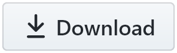</a>
<a href="/../../subscription" title="Get update notifications" aria-label="Get update notifications"></a>
<a href="/../../issues/new/choose" title="Report a bug or request a new feature" aria-label="Report a bug or request a new feature"></a>
<a href="/../../discussions" title="Ask a question or discuss with other users" aria-label="Ask a question or discuss with other users">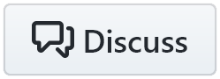</a>
<a href="/../../fork" title="Make your own copy of this project" aria-label="Make your own copy of this project">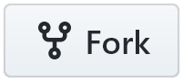</a>
<a href="https://github.com/aminomancer" title="Follow my work" aria-label="Follow my work">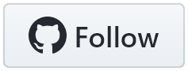</a>
<a href="https://github.com/sponsors/aminomancer" title="Become a sponsor" aria-label="Become a sponsor">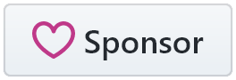</a><br/>
My personal Firefox theme/layout, plus some privileged scripts to add new behaviors and functions.
</p>

<p>

</p>
<p>
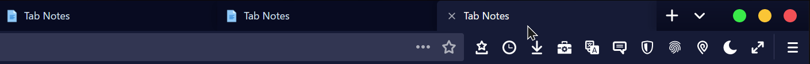
</p>
<p>

</p>

## **Index:**

- [📌 Introduction](#introduction)
- [⚙️ Recommended settings](#recommended-settings)
- [🎨 Theme (CSS)](#theme-css)
  - [💾 Setup](#setup)
    - [📦 Resources & manifest](#resources--manifest)
  - [📐 Design conventions](#design-conventions)
  - [🔍 Details](#details)
    - [🆎 Fonts](#fonts)
    - [🧪 Further modification](#further-modification)
    - [📥 Updating](#updating)
- [📜 Scripts](#scripts)
  - [🔌 Installation](#installation)
  - [💻 Usage](#usage)
    - [✨ Special stylesheets](#special-stylesheets)
    - [🧰 Styling browser toolbox windows](#styling-browser-toolbox-windows)
  - [📚 Script conventions](#script-conventions)
  - [🏷 Script descriptions & links](#script-descriptions--links)
- [💝 Sponsors](#thanks-to-my-sponsors-for-supporting-this-project)
- [🔗 Other useful links](#other-useful-links)
- [🎫 License](/LICENSE)

## **Introduction:**

<details><summary>📌 <b><i>If you don't have much experience with modding Firefox, click to expand...</i></b></summary>

Installing this theme is a bit more involved and requires more decisions than pure CSS themes. So, I'm going to explain what this is, introduce the major moving parts, and define some jargon to ensure that anyone can follow the instructions, regardless of prior experience or knowledge. More advanced users can just skip ahead to [Recommended settings](#recommended-settings).

Because [theme addons](https://developer.mozilla.org/docs/Mozilla/Add-ons/WebExtensions/manifest.json/theme) are restricted to changing colors and other variables, many Firefox users continue to use other, unsupported approaches to customizing the browser. By far the most common is [userChrome customization](https://www.userchrome.org/what-is-userchrome-css.html), wherein you use [CSS files](https://developer.mozilla.org/docs/Web/CSS) to customize the browser visually. To be clear, a CSS file is called a _stylesheet_, not a script. ***For the purposes of this theme, a stylesheet is a file ending in `.css`***. However, just like theme addons are restricted by the theme API, userChrome customization is restricted by the CSS language, which only allows us to _style_ existing elements.

Firefox's frontend uses JavaScript (a human-readable, interpreted scripting language) for a huge variety of dynamic/interactive features. ***A JavaScript file is typically called a script. For the purposes of this theme, a script is a file ending in `.js` or `.jsm`***. As it happens, Firefox exposes a mechanism for loading _custom_ scripts. That mechanism involves giving Firefox an [autoconfig file](https://www.userchrome.org/what-is-userchrome-js.html), which is actually a JavaScript file. At runtime, the autoconfig file has access to the same powers as Firefox's internal scripts. We can use it to run JavaScript code or even load additional script files. So, whereas most other themes are purely visual, this theme can and does create new elements, shortcuts, and dynamic behavior.

A third, lesser known avenue for customization is Firefox's [component registrar](https://searchfox.org/mozilla-central/source/xpcom/components/nsIComponentRegistrar.idl). This is a pretty arcane object called an XPCOM interface, so don't worry about the details — Firefox uses this system to organize itself. Instead of using absolute paths, the Firefox frontend usually uses special URLs to reference its internal files. For example, the "new tab" icon is located at `chrome://browser/skin/new-tab.svg`. This corresponds to a local path that's been registered to this URL. We can use the registrar to do the same thing: to register `chrome://` URLs or _override_ existing ones. If I don't like Firefox's "new tab" icon, I can just replace it by passing a [manifest file](#resources--manifest). That means we don't need to use CSS to modify every element that uses the icon and update that CSS every time one of them is changed. ***For the purposes of this theme, a manifest file is a file ending in `.manifest`***.

Firefox also has a _preferences_ system, which can be managed by navigating to `about:config`. A preference (or pref) is simply a key-value pair. Pref keys are always [strings](https://wikipedia.org/wiki/String_(computer_science)), and their values can be strings, integers, or [Boolean](https://wikipedia.org/wiki/Boolean_data_type). Firefox has several thousands of prefs, which are used for all sorts of things from major configurations to obscure mods and even simply counting events. Firefox's UI can be visually customized to some extent using prefs. Since we can make our own prefs, I also use them to make customizing this theme easier. The most important prefs are listed below in the [settings section](#recommended-settings). Some individual scripts have prefs as well, which will be listed in their [descriptions](#script-descriptions--links).

So, for the purposes of this theme, a "stylesheet" is a `.css` file used to visually customize the browser UI or content; a "script" is a `.js` or `.jsm` file used to functionally customize the browser, and in this theme, usually a `.uc.js` file placed in the [JS](/JS) folder; a "manifest" is a `.manifest` file used to register or override the browser's internal URLs. When I use the term "resources" I'm usually referring to the [resources](/resources) folder, where the theme stores its icons and content stylesheets (among other things). These terms may have other meanings outside of this context, but within this readme, that's what they mean.

</details>

## **Recommended settings:**

For best results, set density mode to `Normal` and theme to `Dark` in the customization menu. (right click on the navbar and click "Customize Toolbar...") I strongly recommend using this on [Firefox Nightly](https://www.mozilla.org/firefox/channel/desktop/#nightly) and updating the theme at least weekly. To that end, you might find it easier to clone the repo to your `chrome` folder so you can pull updates quickly.

I also recommend setting the following prefs in `about:config`. There are two preset user.js files in the [prefs directory](/prefs) that can automatically set the prefs for you and prevent Firefox from changing them on update. Just choose one, rename it to user.js, and move it to your _profile_ folder, not your `chrome` folder. The first of these files, [required.js](/prefs/required.js) contains just the bare minimum prefs to ensure functionality, omitting most of the prefs that represent aesthetic choices. The second, [recommended.js](/prefs/recommended.js), includes the required prefs and some other more subjective prefs that compliment the theme — this is the preset I would personally recommend. There are also OS-specific prefs that are not in either file, so you should still check the list below. The following are in alphabetical order, not in order of importance. Most are optional, but the few that are required are in italics and are marked in the Notes column.<details><summary>⚙ **_Click for a full list._**</summary>
| Pref&nbsp;name | Type | Value | Notes&nbsp;(optional&nbsp;unless&nbsp;otherwise&nbsp;noted) |
|- |- |- |- |
| browser.anchor\_color | String | `#6669ff` | |
| browser.active\_color | String | `#9999ff` | |
| browser.visited\_color | String | `#e34f80` | |
| browser.display.use\_system\_colors | Boolean | false | |
| browser.display.focus\_ring\_style | Number | 0 | |
| browser.display.focus\_ring\_width | Number | 0 | |
| <i>browser.display.windows.non_native_menus</i> | Number | 1 | |
| <i>browser.proton.enabled</i> | Boolean | true | Required |
| <i>browser.proton.places-tooltip.enabled</i> | Boolean | true | Recommended |
| browser.startup.blankWindow | Boolean | false | These two settings eliminate the blank white window during startup |
| browser.startup.preXulSkeletonUI | Boolean | false | |
| browser.tabs.tabMinWidth | Number | 90 | User preference, but mine is 90 |
| browser.tabs.tabmanager.enabled | Boolean | true | Enables "all tabs menu" |
| browser.urlbar.accessibility.tabToSearch.announceResults | Boolean | false | The following hide irritating urlbar results |
| browser.urlbar.quicksuggest.enabled | Boolean | false | |
| browser.urlbar.richSuggestions.tail | Boolean | false | |
| browser.urlbar.searchTips | Boolean | false | |
| browser.urlbar.suggest.quicksuggest.sponsored | Boolean | false | |
| browser.urlbar.tabToSearch.onboard.interactionsLeft | Number | 0 | |
| browser.urlbar.trimURLs | Boolean | false | Don't hide `http://` in the urlbar |
| full-screen-api.transition-duration.enter | String | `0 0` | Remove the fade in/out transition when switching to/from fullscreen |
| full-screen-api.transition-duration.leave | String | `0 0` | |
| full-screen-api.warning.delay | Number | -1 | Remove the warning when switching to/from fullscreen |
| full-screen-api.warning.timeout | Number | 0 | |
| gfx.color\_management.mode | Number | 0 | Disable [color management](https://developer.mozilla.org/en-US/docs/Mozilla/Add-ons/WebExtensions/API/browserSettings/colorManagement). Use a [color calibrator](https://spyderx.datacolor.com/shop-products/display-calibration) for best results. |
| gfx.font\_rendering.cleartype\_params.cleartype\_level | Number | 100 | These settings are a major improvement to text rendering on Windows imo. They shouldn't do anything on Mac/Linux |
| gfx.font\_rendering.cleartype\_params.force\_gdi\_classic\_for\_families | String | `<empty>` | Leave the value completely empty |
| gfx.font\_rendering.cleartype\_params.force\_gdi\_classic\_max\_size | Number | 6 | |
| gfx.font\_rendering.cleartype\_params.pixel\_structure | Number | 1 | |
| gfx.font\_rendering.cleartype\_params.rendering\_mode | Number | 5 | |
| gfx.font\_rendering.directwrite.use\_gdi\_table\_loading | Boolean | false | |
| <i>layout.css.backdrop-filter.enabled</i> | Boolean | true | Required for the acrylic/glass gaussian blur effect |
| <i>layout.css.cached-scrollbar-styles.enabled</i> | Boolean | false | Recommended for the scrollbar styles in userChrome.ag.css |
| <i>layout.css.moz-document.content.enabled</i> | Boolean | true | Required |
| <i>layout.css.xul-box-display-values.content.enabled</i> | Boolean | true | Required |
| <i>layout.css.xul-display-values.content.enabled</i> | Boolean | true | Required |
| layout.css.xul-tree-pseudos.content.enabled | Boolean | true | |
| reader.color\_scheme | String | `dark` | |
| mousewheel.autodir.enabled | Boolean | false | Allow mousewheel ⇅ to scroll ⇄-only scrollboxes |
| prompts.contentPromptSubDialog | Boolean | true | Use the modern content dialog instead of modal prompts |
| <i>svg.context-properties.content.enabled</i> | Boolean | true | Required for making some icons white |
| <i>toolkit.legacyUserProfileCustomizations.stylesheets</i> | Boolean | true | Required, of course |
| ui.IMERawInputBackground | String | `#000000` | This affects the appearance of IME overlays. e.g. when typing Hangul or Pinyin |
| ui.IMESelectedRawTextBackground | String | `#7755FF` | |
| ui.key.menuAccessKeyFocuses | Boolean | false | Disable Alt-key opening menubar if you use my Alt+M hotkey |
| ui.prefersReducedMotion | Number | 0 | Make sure this pref is 0 or doesn't exist if you want animations |
| ui.submenuDelay | Number | 100 | How long before a context menu's submenu opens. 300 default, 100 feels more responsive imo |
| ui.tooltipDelay | Number | 300 | How long before a tooltip opens. The default 300 works for me |
| ui.skipNavigatingDisabledMenuItem | Number | 1 | When focusing menuitems with arrow keys, skip past disabled items |
| ui.SpellCheckerUnderline | String | `#E2467A` | |
| ui.SpellCheckerUnderlineStyle | Number | 1 | Use dotted underline for spell checker. The default groove can get cut off for some fonts |
| <i>ui.systemUsesDarkTheme</i> | Number | 1 | Currently required since there's no light mode yet |
| <i>ui.selecteditem</i> | String | `#2F3456` | Background for selected `<option>` elements and others |
| <i>ui.highlight</i> | String | `hsla(245, 100%, 66%, .55)` | Selection background, among others |
| <i>ui.selecteditemtext</i> | String | `#FFFFFFCC` | Text color for selected `<option>` elements and others |
| ui.textHighlightBackground | String | `#7755FF` | These prefs control the appearance of text highlighted by the findbar. I choose white text on purple/pink background |
| ui.textHighlightForeground | String | `#FFFFFF` | |
| ui.textSelectBackground | String | `#FFFFFF` | |
| ui.textSelectAttentionBackground | String | `#FF3388` | For Fx > v96 |
| ui.textSelectAttentionForeground | String | `#FFFFFF` | For Fx > v96 |
| ui.textSelectDisabledBackground | String | `#7755FF` | For Fx > v96 |
| ui.textSelectBackgroundAttention | String | `#FF3388` | For Fx ≤ v96 |
| ui.textSelectBackgroundDisabled | String | `#7755FF` | For Fx ≤ v96 |
| userChrome... | | | Several of my scripts use custom prefs beginning with `userChrome` for user customization. See the individual script files for details. The stylesheets also use the following: |
| userChrome.bookmarks-toolbar.icons-only | Boolean | false | If true, bookmark buttons in the toolbar are just square icons |
| userChrome.contextmenu.reduce-menuseparators | Boolean | false | If true, hide some of the separators in the main context menu to reduce clutter |
| userChrome.css.hide-promotion | Boolean | false | If true, hide official ads on system pages, e.g. for Mozilla VPN |
| userChrome.css.mac-ui-fonts | Boolean | true | Replace UI font with SF Pro, the system font for macOS. [Click here for details](#fonts) |
| userChrome.css.menupopup-shadows | Boolean | false | Add a shadow behind context menus and panels |
| userChrome.css.remove-tooltip-borders | Boolean | false | If true, remove the thin border on tooltips. If false, use [tooltipShadowSupport.uc.js](#tooltip-shadow-support) |
| userChrome.css.titlebar-buttons-on-left | Boolean | false | If true, move the titlebar buttons (close/min/max) to the left side of the window |
| userChrome.css.ctrl-tab-backdrop-overlay | Boolean | true | If true, dim the rectangular area behind the Ctrl+tab panel to increase contrast |
| userChrome.css.wikipedia.dark-theme-enabled | Boolean | true | Enable the custom dark theme for Wikipedia.org |
| userChrome.findbar.hide-on-unfocus | Boolean | false | Automatically hide the findbar when you blur (unfocus) it |
| userChrome.panels.allow-height-flex | Boolean | false | If true, allow panels to flex down in height. Will cause stutters on weaker hardware |
| userChrome.panels.vibrant-fxa-banner | Boolean | true | Highlight the profile button in the app menu with a vibrant background |
| userChrome.tabs.all-tabs-menu.reverse-order | Boolean | true | Display the all tabs menu in reverse order (newer tabs on top, like history) |
| userChrome.tabs.new-loading-spinner-animation | Boolean | true | Replace the tab loading throbber with a spinning animation |
| userChrome.tabs.pinned-tabs.close-buttons.disabled | Boolean | true | This controls whether close buttons are shown on pinned tabs |
| userChrome.tabs.rounded-outer-corners.disabled | Boolean | false | This controls whether tabs have rounded bottom corners<br/>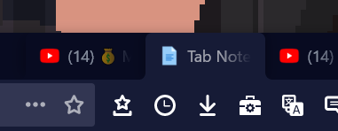 |
| userChrome.tabs.tooltip.always-show-lock-icon | Boolean | false | There's an icon in the tab tooltip representing page security. It's expanded by [this script](/JS/restoreTabSoundButton.uc.js) to show many security types. But by default, the icon is hidden on fully secure pages. Setting this pref to true reverses that |
| userChrome.urlbar.hide-bookmarks-button-on-system-pages | Boolean | true | Hides the urlbar's bookmark button on system pages & new tab page |
| userChrome.urlbar.hide-pointless-icons | Boolean | true | Hide urlbar notification icons that don't offer any action (e.g. DRM icon) |
| userChrome.urlbar-results.disable\_animation | Boolean | false | Toggle to true if you don't want the urlbar results to animate as they pop up |
| userChrome.urlbar-results.hide-help-button | Boolean | true | New "Firefox Suggest" urlbar results have little help buttons. This will hide them |
| widget.content.allow-gtk-dark-theme | Boolean | true | May style some in-content elements consistently with Linux themes |
| widget.disable-native-theme-for-content | Boolean | true | Enables Firefox's custom appearance for elements like checkboxes. Skips the "native" appearance given by the OS stylesheets. |
| <i>widget.macos.native-context-menus</i> | Boolean | false | Required to use some of my scripts on macOS, and for context menu styles on macOS |

</details>

Because most of the scripts and stylesheets here are tethered to the Nightly release channel, I also recommend disabling automatic updates in your Firefox preferences and downloading [my update alert system](#update-notification-slayer) that lets you choose when to update and notifies you unobtrusively when an update is available. Rather than flashing a popup window that requires you to click something to dismiss it, updates will just add a green update badge to the app menu "hamburger" button. To update you can just click the hamburger button, then click the update banner at the top of the app menu.

## **Theme: (CSS)**

### **Setup:**

As with any CSS theme, you need to make a `chrome` folder in your profile's root directory (which can be found in `about:profiles`) and place the files from this repo into it. For user stylesheets to work you also need to enable some of the prefs described above, or download one of the [prefs files](/prefs), rename it to user.js, and place it in your profile's root directory. This will allow the basic userChrome and userContent stylesheets to take effect, but some additional steps are required beyond that.

This theme requires more technical setup than most because it changes a lot of lower-level stuff like javascript methods and icon/animation source code, but if you follow the instructions fully it'll work for anyone on any modern desktop OS, regardless of background knowledge. It requires [**fx-autoconfig**](https://github.com/MrOtherGuy/fx-autoconfig) to register the icon package and replace some of Firefox's lower-level stylesheets. Instructions for setting up fx-autoconfig are [below](#installation). To be clear, this _specific_ loader is required, unless you know how to register your own manifest from scratch.

The theme is tightly integrated with some (though not all) of the scripts on this repo. Although fx-autoconfig is mainly required for the purpose of registering files with the manifest, it also allows you to load scripts. So because you already need fx-autoconfig for the basic theme to work, I recommend reading through the [scripts section](#scripts) to decide which scripts you want to use. Scripts with ✨ stars next to their description are particularly important for the theme to work as intended. In particular, the theme fundamentally requires the agent & author sheets listed in the [special stylesheets](#special-stylesheets) section, and they are loaded by a script. So although most of the scripts are optional, a fully scriptless installation of this theme is not possible.

⛔️ _Please **do not** install every script in the JS folder at once. Unlike the theme's other resources, not all of the scripts are meant to be used at the same time. For example, a few scripts have both a standalone and a theme version which are totally redundant. Undesired scripts can be deleted from the JS folder or disabled via the Tools > userScripts menu. After disabling a script and restarting Firefox, fx-autoconfig will no longer run the script at startup._

#### **Resources & manifest:**

If you haven't already, download the [resources](/resources) folder and place it in your `chrome` folder, along with the CSS files. fx-autoconfig will automatically register this folder to the path `chrome://userchrome/content/`. This theme also requires downloading [utils/chrome.manifest](/utils/chrome.manifest). Most of the theme will work without it, but it's crucial for certain things.

<details><summary>📦 <b><i>Here's why... (click to expand)</i></b></summary>

In particular, it replaces some icons and modifies some internal scripts and stylesheets that would be very hard to override with either CSS or javascript. Simply replace the chrome.manifest file from fx-autoconfig with my version. This will strictly redirect some `chrome://` URIs from the vanilla files to files from this theme, so the changes will apply globally. Without this, it would be very difficult to do certain things. We use this to restore the pre-Proton tab sound icons, to change the appearance of plaintext files and other lower-level internal pages, and to change the styling for very hard-to-reach elements.

For example, menupopup scrollbuttons are contained in shadow trees within shadow trees. There is no way to select them with any kind of specificity except to use javascript to give them custom classes/attributes, _or_ to inject stylesheets into the shadow trees. I used to use the latter method but now that we use the manifest so liberally (and still judiciously) it makes more sense to modify arrowscrollbox.css with the manifest. So now we can make blanket changes to how these elements are styled without losing the ability to select attributes or classes on the shadow host.

The manifest also makes it _much_ easier to change icons, and makes it possible to customize some icons that would be simply impossible to change otherwise. For example you would not be able to change the icon for an element like `<image src="chrome://global/skin/icons/icon.svg">` because `src` is not a CSS property. But with the manifest, we can change which icon actually exists at that URL. For all these reasons, the manifest has become a central part of this theme and is one of my go-to solutions for difficult problems because it's so clean.

</details>

### **Design conventions:**

<details><summary>📐 <b><i>The CSS theme's basic design philosophy... (click to expand)</i></b></summary>

This is a standard theme, not a "high-contrast theme" or a "compact theme." I aim for compactness similar to [Firefox's Photon UI](https://design.firefox.com/photon/). I designed this theme for my own use, so the colors are oriented toward my own displays. These are color-grading monitors so the color profile is created by a [color calibrator](https://spyderx.datacolor.com/shop-products/display-calibration) based on Rec709-Rec1886. This is why I recommend setting `gfx.color_management.mode` to `0`.

The basic aim of this theme's colors can be summed up as "dark mode." I think dark gray is a little boring and overdone, so I went with dark indigo and slate colors in the UI, and dark gray in content. As everything revolves around "dark mode," any instance of a big white interface is jarring and creates a negative user experience. So the theme modifies every parent process interface and even many content interfaces to eliminate these light vestiges. It includes stylesheets for some specific websites, but by and large you're expected to use [Dark Reader](https://addons.mozilla.org/firefox/addon/darkreader) if you want consistent dark content. It also includes stylesheets for several extension pages, since Dark Reader can't style most of them.

One of the biggest changes in Proton had to do with icons. Large swathes of icons were removed and many basic icons were redesigned with much thinner strokes. I don't think this was a wise change. For one, the new icon style doesn't look as good or as distinctively "Mozilla" as the previous icon style. But it has created an enormouse amount of work for Mozilla that isn't even being tackled. Even Firefox itself hasn't updated every icon to the new "thin" style. Many icons are mismatched. But if you look at virtually any other Mozilla product you'll see they're still using the old icons.

On every page of [addons.mozilla.org](https://addons.mozilla.org/en-US/firefox/) you can see the old style of icons. Sometimes it's just a minor visual difference, but other times you can hardly identify the new icon with the old icon. This is especially problematic for icons like [tab.svg](/resources/skin/tab.svg) whose shapes were dramatically changed. So now all these products and webpages will need to be updated with the new icons. By the time that gets finished, Firefox will probably have already moved on to yet another new icon style.

So, one of the objectives of this theme is to restore all the icons to their pre-Proton style. And it does that pretty successfully by using a [component manifest](#resources--manifest) to replace the icons just upstream of the IO level. Another objective is to add icons back to menus. I think Proton is generally an improvement over Photon, but many people would agree that Proton often looks for minimalism in the wrong places. To create clean, simple menus evocative of Google Chrome, Firefox has removed icons from virtually every menu, and in doing so, has fallen behind Microsoft Edge in visual clarity. The worst part is that Firefox extensions still add icons to these menus, creating a glaring inconsistency.

I spent hundreds of hours reconstructing these [menu icons](/uc-context-menu-icons.css). I think part of the reasoning behind removing these icons was that not all of the menus had icons in the first place, and too many reused icons. They were inconsistent from the start, because apparently Mozilla doesn't have enough illustrators. So in restoring menu icons, I often had to source new icons, but Mozilla's pre-Proton icons are very distinctive. So I have designed dozens of new icons to adhere to the pre-Proton visual style. It's been a long-running effort but essentially every menu item in the main UI has icons. If any are missing, please post an [issue](/../../issues/new/choose) so I can resolve it.

I said before that this is not a "compact theme," but I think my idea of "normal density" is a bit more compact than the Proton designers'. So, one of the principles is to compactify anything that is superfluously large. For example, Firefox's Findbar has always been needlessly huge, filling an arbitrarily large amount of horizontal space with emptiness, while simultaneously wasting vertical space. One of the very first things I did with this theme was to turn the Findbar into a floating panel of about 400 x 40px. It floats on top of the content rather than pushing it up or down. I turned all the buttons and checkboxes into icons. It wound up looking very much like VS Code's findbar, so I decided to use VS Code's icons for it.

Proton also removed most of Firefox's UI animations. This should make Firefox more responsive on low-end hardware, so it's a fine decision. But this repo is not intended for low-end hardware, so we can get away with using lots of animations. The theme and some of the scripts restore animations that were built into Firefox prior to Proton. In other cases, they create new animations and transitions to make things feel smoother. I try to avoid what I consider excessive animations, but everyone has different tastes. By my estimate, the theme is in the middle of that spectrum.

For linting/formatting, I use [Prettier](https://prettier.io/), [Stylelint](https://stylelint.io/) and [the Stylelint VS Code extension](https://marketplace.visualstudio.com/items?itemName=stylelint.vscode-stylelint), with [stylelint-config-airbnb](https://www.npmjs.com/package/stylelint-config-airbnb) for base rules and [stylelint-config-prettier](https://www.npmjs.com/package/stylelint-config-prettier) for compatibility.

</details>

### **Details:**

<details><summary>🔍 <b><i>Explanation of the major files on this repo... (click to expand)</i></b></summary>

The `userContent.css` file handles stuff like the devtools, some UI pages and context menus, plaintext pages, browser background color while pages are loading, and the built-in HTML video player. It also includes some reskins for specific websites and extensions, like my personal dark mode layout for Wikipedia, or [Dark Reader's](https://addons.mozilla.org/firefox/addon/darkreader) popup. The Firefox UI is increasingly integrated with content browsers, so it's not feasible to make a theme so dramatically different from vanilla Firefox without userContent.css. The big content area isn't the only browser, there are tiny ones all over the place. For example, several modal dialogs that appear to be part of the parent process are actually content.

So `userContent.css` isn't strictly required for the rest of the theme to work, but without it you'll find some elements look inconsistent with the theme, and it also takes care of some issues that make the fabled global dark mode harder to realize. If you already have a `userContent` file, I'd suggest changing its name to `custom-content.css` and placing it in the [resources/in-content](/resources/in-content) folder. The theme doesn't include this file, since it's purely intended for end-user modifications, but it automatically loads the file if it exists. It loads last and therefore wins any conflicts of equal priority & specificity. You can also delete any of the [content stylesheets](/resources/in-content) you don't want to use, or remove their `@import` rules from userContent.css.

I've bundled some of my addons in this repo as well. They are in the [extensions](extensions) folder. My custom new tab page is signed (it's a modded fork of [Tab Notes](https://addons.mozilla.org/firefox/addon/tab-notes) by wildsky) but you will still need to "install addon from file" in `about:addons` since you're not downloading the extension package from a Mozilla domain. There are a few search engine addons in the [extensions/search-extensions](extensions/search-extensions) folder. These simply add one-off search engines for Google Images, Amazon, and Wikipedia, and include search suggestions/autocomplete. Firefox already comes with Amazon and Wikipedia addons, but they have ugly icons and unnecessarily long labels. Mine are simply called Amazon and Wikipedia, and have icons that match the theme. Some of Firefox's built-in search engines also lack search suggestions. Some are signed and hosted on AMO, but others remain unsigned due to [an AMO bug](https://github.com/mozilla/addons-linter/issues/3911). You can download the following from AMO: [YouTube](https://addons.mozilla.org/firefox/addon/youtube-opensearch-engine); [Google Translate](https://addons.mozilla.org/firefox/addon/google-translate-engine); [Bugzilla](https://addons.mozilla.org/en-US/firefox/addon/bugzilla-engine); [MDN Web Docs](https://addons.mozilla.org/en-US/firefox/addon/mdn-engine).

</details>

#### **Fonts:**

<details><summary>🆎 <b><i>How to use a better font... (click to expand)</i></b></summary>

`userChrome.css` doesn't require any fonts, but there's an optional preference in about:config which lets you replace fonts in the UI (not in-content) with [SF Pro](https://developer.apple.com/fonts), macOS's system font, on Windows or Linux. You can enable this by [downloading the font](https://devimages-cdn.apple.com/design/resources/download/SF-Pro.dmg), unpacking it with 7-Zip, installing it as normal, and setting `userChrome.css.mac-ui-fonts` to `true` in about:config. This requires a local copy of all variants of the font, including "SF Pro," "SF Pro Display," "SF Pro Text," and "SF Pro Rounded." Additionally, `userContent.css` can use [Overpass Mono](https://fonts.google.com/specimen/Overpass+Mono) for plaintext files, if you have it installed. Otherwise it just uses your default monospace font.

</details>

#### **Further modification:**

<details><summary>🧪 <b><i>How to customize the theme yourself... (click to expand)</i></b></summary>

If you want the functional features shown in the animations, you'll need to install some of the scripts. The stylesheets do not strictly require installing any scripts, but some scripts are designed to solve problems that CSS can't, so I recommend reading the full list of [script descriptions](#script-descriptions). Since the theme itself already requires fx-autoconfig, installing the scripts doesn't require any extra time or setup. Most scripts do not require installing the CSS theme either, but the few exceptions are noted in the descriptions and at the top of each script file. Instructions and explanations for the scripts are [below](#installation).

Most of the important colors can be changed in [uc-low-globals.css](resources/layout/uc-low-globals.css), [uc-globals.css](/uc-globals.css) and [uc-variables.css](/uc-variables.css). Changing the hues is easy, but at the moment I wouldn't recommend trying to convert it to a "light" color scheme. Instead of modifying uc-globals and uc-variables directly, it'll be easier to make your own stylesheet that overrides the variables.

To modify the main window UI (as you'd do with userChrome.css) place your custom chrome styles in the `custom-chrome.css` file in the `chrome` folder. To modify content (as you'd normally do with userContent.css) place your custom content styles in the `custom-content.css` file in [resources/in-content](/resources/in-content). The theme automatically looks for and imports these stylesheets. They load after the theme's stylesheets, so they will override rules from the theme with equal specificity.

Normally in Firefox, the default search icon in the urlbar is a magnifying glass. This is the icon that shows when you start typing in the urlbar. In previews of duskFox you might have noticed that this icon instead looks like a Google logo, a Firefox logo, or something else. This is achieved with the [Search Mode Indicator Icons](#search-mode-indicator-icons) script. Combined with the CSS theme, it will automatically detect your default search engine (and your one-off search engines) and try to find a matching icon, minimizing customization effort. Check the script description for more instructions.

</details>

#### **Updating:**

<details><summary>📥 <b><i>How to update... (click to expand)</i></b></summary>

[Release packages](/../../releases/) are available as a courtesy, but since the theme and scripts are updated on a daily basis to keep up with Nightly, the latest release package may not be completely up to date. If you want the very latest stylesheets/scripts, you should either [download the source code](/../../archive/HEAD.zip) and drag its contents to your profile's `chrome` folder, [clone the repo](https://docs.github.com/repositories/creating-and-managing-repositories/cloning-a-repository) directly to your `chrome` folder, (use [GitHub Desktop](https://desktop.github.com) if all of this sounds like gibberish to you) or download individual folders with [GitZip](https://addons.mozilla.org/firefox/addon/gitzip) or [Refined GitHub](https://addons.mozilla.org/firefox/addon/refined-github-).

</details>

## **Scripts:**

The files in the [JS](/JS) folder are not content scripts like you'd load in Tampermonkey. They're meant to execute in the same context as Firefox's internal scripts. They're scripts for the Firefox frontend itself rather than for webpages. The Firefox UI is largely built with markup, styled with CSS, and dynamically modulated with JavaScript — just like a webpage. So to modify the UI visually, CSS is commonly used. But CSS can only do so much. Even some of this theme's features that appear to be purely visual may require JavaScript, like the search engine icons shown in the GIF above.

These scripts need to be loaded by an autoconfig script loader. I recommend [**fx-autoconfig by MrOtherGuy**](https://github.com/MrOtherGuy/fx-autoconfig) which is robust and uses the safest method I'm aware of. Some of my scripts are not fully compatible with loaders other than MrOtherGuy's. In particular, most will be incompatible with xiaoxiaoflood's loader, and a few will be incompatible with Alice0775's loader.

⛔️ _Please **do not** install every script in the JS folder at once. Unlike the theme's other resources, not all of the scripts are meant to be used at the same time. For example, a few scripts have both a standalone and a theme version which are totally redundant. Undesired scripts can be deleted from the JS folder or disabled via the Tools > userScripts menu. After disabling a script and restarting Firefox, fx-autoconfig will no longer run the script at startup._

### **Installation:**

⚠️ _If you plan to install scripts in a **new** profile, make sure you run Firefox with that profile at least once before installing any scripts. If you're installing scripts on an existing profile that you've already used, then don't worry about this. When you first create a profile, Firefox needs to set some things up during runtime. Although CSS is fine, you don't want any third-party javascript running during this process. So launch Firefox with the appropriate profile, log into your Firefox account, (if you have one) then quit, install the scripts, and restart the application._

You first need to find your Firefox installation folder. On Windows that's `C:/Program Files/Firefox Nightly/`. On Linux it should be `usr/lib/firefox/`. On macOS this is more complicated. You need to open the application file itself, probably in `Macintosh HD/Applications/`. It's the file you double-click to open Firefox, but it's actually a package, not a binary. If you right click it, there will be an option in the context menu labeled "Show Package Contents." Clicking this takes you to the app constants. From there, navigate to `Contents/Resources/` to reach the root directory. So whichever OS you're on, you should end up with...

1. &nbsp; a file called `config.js` in your Firefox installation's root directory;
2. &nbsp; a folder called `defaults` in the root directory;
3. &nbsp; a folder called `pref` inside that `defaults` folder;
4. &nbsp; a file called `config-prefs.js` inside that `pref` folder;
5. &nbsp; a `JS` folder in your profile's `chrome` folder;
6. &nbsp; a `utils` folder in your `chrome` folder, containing `chrome.manifest` and `boot.jsm`;

⚠️ _If you're using my **theme**, (the CSS files) you should also have a `resources` folder in your `chrome` folder, containing all the icons and content stylesheets._

You may already have a file called `channel-prefs.js` inside the `pref` folder. This is unrelated, so leave it alone.

If you're using fx-autoconfig like I recommended, then your scripts should go in the `JS` folder by default. fx-autoconfig comes with scripts for loading agent and author sheets. If you use those scripts, your agent/author sheets should go in the `resources` folder. But if you're using [my agent/author sheet loader](#agentauthor-sheet-loader) instead, then agent/author sheets (the files ending in .ag.css or .au.css) should go in the `chrome` folder with the rest of your userchrome sheets.

The sheet loader that comes with fx-autoconfig will work just fine, and has one advantage over mine, but it will not load your agent/author sheets in browser toolbox windows. [See the section below](#styling-browser-toolbox-windows) if you want to style native-anonymous elements or shadow parts in the toolbox. Significant applications include modifying tooltips and scrollbars in browser toolbox windows. If you follow this guide fully, installing all the CSS files and my agent/author sheet loader, you'll end up with the custom tooltips and scrollbars in every window, including the devtools.

⚠️ _Older versions of this theme required users to rename the `JS` folder to `script`. The name was arbitrarily set before I started recommending fx-autoconfig, and I never bothered to change it until now. But this is no longer required — scripts go in the JS folder that comes with fx-autoconfig. So if you're updating from an old version of the theme, please update [utils/chrome.manifest](/utils/chrome.manifest) and change the `script` folder's name to `JS`._

### **Usage:**

After you've installed the files, the script loader will locate any scripts you place in the proper folder that end in `.uc.js`. Once you have this set up you can download scripts, put them in the correct folder for your script loader, restart, and you should see the changes immediately. When updating scripts, be sure to clear your startup cache. With fx-autoconfig, you can click "Tools" in the menubar, then "userScripts," then "Restart now!" and it will clear the startup cache as it restarts. If you install [App Menu Mods](#app-menu-mods), there will also be a restart button in the app menu (the hamburger button at the end of the navbar). Right-clicking or Ctrl+clicking this button will clear the cache and restart. To manually clear the startup cache, you can navigate to `about:profiles` and click the "Open Folder" button in your profile's local directory row. Then quit Firefox, and in the local directory delete the folder labeled `startupCache` before restarting the browser.

Firefox is updated every night, so my theme and scripts are updated on a regular basis to ensure compatibility with the latest build from [mozilla-central](https://hg.mozilla.org/mozilla-central), which is distributed through the [Firefox Nightly](https://www.mozilla.org/firefox/channel/desktop/#nightly) branch. This means that files on this repo are not expected to be compatible with every Stable, ESR, Beta, or Developer Edition release of Firefox — only _Nightly_. If you update Firefox and a script stops working, or your UI suddenly looks ugly, check the repo to make sure your scripts are up to date. Compare the `@version` number at the top of a given file to the version of your copy. If your problem is still present, feel free to post in the [Issues](/../../issues/) section.

If you use any of my scripts, please disable telemetry. If you use one of my [user.js files](/prefs), it will handle this for you. Otherwise, you can disable telemetry by navigating to `about:preferences#privacy` and unticking the boxes towards the bottom that say "Allow Nightly to send technical and interaction data to Mozilla" and "Allow Nightly to install and run studies." Because we're modifying the way the browser's internal systems work, sending Mozilla data about your browser environment is useless and may actually confound their studies. Any interaction data emitted by functions that we modify with these scripts has the potential to confuse and mislead Firefox developers and waste valuable time.

Users can't disable the crash reporter at the profile level. The user.js files will disable auto-reporting, but in the event that Firefox crashes, a dialog will still appear, asking if you want to send a report. You can simply close the window to avoid sending a report. It's possible to disable the crash reporter at the app level by making an [environment variable](https://www.schrodinger.com/kb/1842) called `MOZ_CRASHREPORTER_DISABLE` and setting its value to `1`. If you think one of my scripts is causing a global crash (unlikely) and you want to send _me_ a report, you can disable the reporter while still preserving crash dumps by instead setting the variable `MOZ_CRASHREPORTER_NO_REPORT` to `1`. The dumps will be saved in your profile directory, in a folder called `minidumps`.

#### **Special stylesheets:**

In the main directory on this repo you might notice two files: [userChrome.ag.css](/userChrome.ag.css) and [userChrome.au.css](/userChrome.au.css). The _"ag"_ is an abbreviation for user _agent_ sheet, and _"au"_ is an abbreviation for _author_ sheet. They're used for rules that would not work if we put them in `userChrome.css`. But Firefox will not load these stylesheets on its own. These are loaded by the [Agent/Author Sheet Loader](#agentauthor-sheet-loader). The script does the same general thing as two of the files included with fx-autoconfig, but if you want the stylesheets to work in the devtools, (e.g. for context menus) you need the script from my repo. And since you don't want to load duplicate stylesheets, delete the scripts included in fx-autoconfig's `JS` folder.

These agent/author sheets handle some of the most common and problematic elements like tooltips, scrollbars, etc. The main purposes for using special stylesheets are 1) to use CSS syntax that is forbidden to user sheets, such as the `::part(...)` pseudo-element; 2) to style native-anonymous content like default tooltips or scrollbars; or 3) to override the vanilla style rules without needing to use the `!important` tag. In particular, we can use the author sheet to make (or revert) general rules without affecting more specific rules in the built-in stylesheets, or dealing with a bunch of style conflicts and cascading confusion.

⚠️ _Other themes/loaders, including older versions of this theme, may use the file suffix `.as.css` for the agent sheet, instead of `.ag.css`. I've switched to "ag" for the sake of consistency with fx-autoconfig. If you have a `userChrome.as.css` file left over from something, you can just delete it and replace it with `userChrome.ag.css`. The [agent sheet loader](#agentauthor-sheet-loader) will ignore `.as.css` files._

#### **Styling browser toolbox windows:**

There's another script called [Browser Toolbox Stylesheet Loader](#browser-toolbox-stylesheet-loader) which is necessary if you want the theme to apply to elements in browser toolbox windows. My theme mainly uses this to make all context menus and scrollbars in the devtools consistent with the context menus and scrollbars in the main chrome window. It doesn't load a special stylesheet like the other module, it just loads userChrome and userContent.css into the devtools.

But by itself it doesn't do anything. It only works in conjunction with modifications I made to fx-autoconfig. I won't upload the modified script loader since it's not my original work, but you can either 1) follow the instructions below to modify it yourself; or 2) just copy all the contents of your `chrome` folder into `{your profile folder}/chrome_debugger_profile/chrome/`.

The problem with copying everything to `chrome_debugger_profile` is that you may need to reset the debugger profile from time to time. That's why I worked out a method for dynamically loading the main profile's scripts and stylesheets into toolbox processes without modifying the debugger profile.<details><summary>💬 <i><b>Here's how if you want to do the same: (it's pretty fast)</b></i></summary>

1. Download and install [fx-autoconfig](https://github.com/MrOtherGuy/fx-autoconfig) as normal.
2. Open `config.js` from your Firefox installation folder, in a text editor.
3. After line 8, (after it says `Components;`) add some new lines and paste this:

```
function traverseToMainProfile(str) {
    let dir = Cc["@mozilla.org/file/directory_service;1"]
        .getService(Ci.nsIProperties)
        .get(str, Ci.nsIFile);
    if (!dir.exists()) {
        let toAddChrome = false;
        while (dir.target.includes("chrome_debugger_profile")) {
            dir = dir.parent;
            toAddChrome = true;
        }
        if (toAddChrome) dir.append("chrome");
    }
    return dir;
}
```

4. Then replace the entire next line of code (the one that starts with `let cmanifest`) with this:

```
let cmanifest = traverseToMainProfile('UChrm');
```

5. Now save `config.js` and exit.
6. Go back to your `chrome` folder, and open `boot.jsm` from the `utils` folder.
7. Go to the end of line 57 and hit enter twice to make two new lines, so you should now be at line 59.
8. Paste this:

```
function traverseToMainProfile(str){
  let dir = Services.dirsvc.get(str,Ci.nsIFile);
  if (!dir.exists()) {
    let toAddChrome = false;
    while (dir.target.includes('chrome_debugger_profile')) {
      dir = dir.parent;
      toAddChrome = true;
    }
    if (toAddChrome) dir.append('chrome');
  }
  return dir;
}
```

9. Go to what should now be line 79 (used to be line 66 — this line starts with `BASE_FILEURI:`) and replace the entire line with this:

```
BASE_FILEURI: Services.io.getProtocolHandler('file').QueryInterface(Ci.nsIFileProtocolHandler).getURLSpecFromDir(traverseToMainProfile('UChrm')),
```

10. Go to what should now be line 83 (used to be line 70 — this line starts with `get chromeDir()`) and replace the entire line with this:

```
get chromeDir() {return traverseToMainProfile('UChrm')},
```

11. Save `boot.jsm` and exit.
12. That's it! The scripts that are in your main profile folder should now run in browser toolbox windows, even though they're not in the `chrome_debugger_profile` folder. Make sure you download the [Browser Toolbox Stylesheet Loader](#browser-toolbox-stylesheet-loader) so stylesheets will be loaded too.
</details>

### **Script conventions:**

<details><summary>📚 <b><i>The scripts' basic design philosophy... (click to expand)</i></b></summary>

Using autoconfig places some constraints on design. We can't always write these scripts in exactly the same style that Firefox components are written, because Firefox scripts are executed in a different way. And the way the scripts are loaded encourages a procedural style. Some might prefer this from the outset for various reasons. I do use a procedural style for the shortest scripts that are least likely to change or be extended. But for the most part you'll notice a more object-oriented style in these scripts, which might seem weird. A lot of scripts have classes that are only instantiated once per script execution, for example.

The main reason I use this style in spite of the subscript loader is because it makes it a lot easier to hook into the scripts from outside. My goal in doing that isn't encapsulation, it's just creating little modules that other scripts can access and modify without re-instantiating them, that can be modified or debugged from the browser console. This is why I will often define a script's class instance on a property of the global object, even though everything in the script references it with `this`.

Another reason is because, at least in my opinion, the bulk of Firefox's JavaScript component code is object-oriented, not necessarily by choice but because of other constraints on component code. For example, [JSActors](https://firefox-source-docs.mozilla.org/dom/ipc/jsactors.html) _must_ use classes, by design. And custom element definitions always use classes or function factories because custom elements are object-oriented by definition.

One way or another, something like half of these scripts are modifying object-oriented components, and nearly another half are creating new object-oriented components. Keeping in lockstep with Firefox's JavaScript conventions makes everything easier, from initial design to debugging and to updating. So that's why I do it even if it's not as concise and performant as a more procedural style would be.

Even within a given script, I will often use object properties instead of block scoped variables even though they're only referenced in one block. This is because I may need to write another script to be compatible with it, so another script may need to access that state. I also may need to mutate it from the browser console in the process of debugging. And it doesn't work to write the script in one style for debugging, then refactor it for release. Nothing is ever final on this repo, because it's all anchored to Firefox Nightly. Firefox is updated daily, so these scripts need to be updated regularly too.

Another goal is to make every script as "standalone" and "portable" as possible. I don't want to write scripts with a bunch of dependencies. So my intention is that each script is a single file and requires nothing else except Firefox and fx-autoconfig, the script loader. Some of the scripts are written primarily to extend duskFox (the CSS theme) so those scripts will obviously require the theme as well. But to get one of the scripts below to work, you shouldn't need to download other files.

There are a few exceptions. [Restore pre-Proton Tab Sound Button](#restore-pre-proton-tab-sound-button) is listed as an autoconfig script, but the bulk of that mod is actually a replacement of [tabbrowser-tab.js](https://searchfox.org/mozilla-central/source/browser/base/content/tabbrowser-tab.js). As mentioned earlier, that kind of replacement can only be done through the component registrar, by using the `override` syntax in [chrome.manifest](#resources--manifest). And it also requires restoring CSS for the removed elements. So those who use duskFox will already have that replacement and the necessary CSS. The script is just for dealing with tooltips on the sound & close tab buttons. So in that sense, it's not standalone. Non-duskFox users will need to download additional files, as discussed in the script description.

Some of the scripts, like [Restore pre-Proton Star Button](#restore-pre-proton-star-button), come in two versions — a duskFox version and a standalone version. The difference is simply whether the script includes the necessary CSS. duskFox already includes all the CSS for those scripts, because it's easier to read in stylesheet form. So if you want to modify it, you can. But we don't want to load a bunch of redundant CSS, so I made versions of these scripts that simply have the CSS removed. That means these versions are not standalone, but they're only intended for those who are using or plan to use duskFox.

Every script is either localized or localizable. That means that some scripts will use Firefox's built-in localization systems to retrieve strings (text) from language packages. In other words, buttons, labels, tooltips, and menus added by these scripts will be automatically translated into other languages. However, Firefox only has so many translations. Sometimes I can take advantage of phrases that already exist in Firefox, but in other cases the phrases I need to use are totally novel and have no corollaries in Firefox. In those cases (see [this script](/JS/debugExtensionInToolbarContextMenu.uc.js) for example), there will be an object near the top of the script labeled `config` or `l10n` where the strings are defined. So if your Firefox installation is in a language other than English, you can translate the phrases yourself and replace them there.

Initially, I tried to make these scripts compatible with as many script loaders as possible. But it dawned on me that I couldn't do that with certain scripts, and maybe shouldn't try at all. So I only design these scripts with fx-autoconfig in mind. That doesn't mean that none of them are compatible with other script loaders, but it does mean I don't know which ones are or are not, since I only test with fx-autoconfig.

For linting/formatting, I use [Prettier](https://prettier.io/), [ESLint](https://eslint.org/) and [the ESLint VS Code extension](https://marketplace.visualstudio.com/items?itemName=dbaeumer.vscode-eslint), with  [eslint-config-airbnb](https://www.npmjs.com/package/eslint-config-airbnb) for base rules and [eslint-config-prettier](https://www.npmjs.com/package/eslint-config-prettier) for compatibility.

<details><summary>📋 <i><b>Here are the contents of the project's ESLint config...</b></i></summary>

```
{
    "env": {
        "browser": true,
        "es2021": true
    },
    "extends": ["airbnb-base", "prettier"],
    "parserOptions": {
        "ecmaVersion": "latest",
        "sourceType": "module"
    },
    "rules": {
        "indent": "off",
        "max-len": "off",
        "quotes": [
            "error",
            "double",
            {
                "avoidEscape": true,
                "allowTemplateLiterals": true
            }
        ],
        "curly": ["error", "multi-or-nest"],
        "camelcase": [
            "error",
            {
                "properties": "never",
                "ignoreDestructuring": false,
                "ignoreGlobals": true
            }
        ],
        "max-classes-per-file": "off",
        "no-cond-assign": ["error", "except-parens"],
        "no-unused-vars": [
            "error",
            {
                "vars": "local",
                "args": "after-used"
            }
        ],
        "no-use-before-define": [
            "error",
            {
                "functions": false,
                "classes": false
            }
        ],
        "no-fallthrough": [
            "error",
            {
                "commentPattern": "break[\\s\\w]*omitted"
            }
        ],
        "no-unused-expressions": [
            "error",
            {
                "allowTernary": true,
                "allowTaggedTemplates": true
            }
        ],
        "default-param-last": "off",
        "no-promise-executor-return": "off",
        "no-param-reassign": "off",
        "no-return-assign": "off",
        "prefer-destructuring": "off",
        "no-underscore-dangle": "off",
        "no-restricted-syntax": [
            "error",
            {
                "selector": "ForInStatement",
                "message": "for..in loops iterate over the entire prototype chain, which is virtually never what you want. Use Object.{keys,values,entries}, and iterate over the resulting array."
            },
            {
                "selector": "LabeledStatement",
                "message": "Labels are a form of GOTO; using them makes code confusing and hard to maintain and understand."
            },
            {
                "selector": "WithStatement",
                "message": "`with` is disallowed in strict mode because it makes code impossible to predict and optimize."
            }
        ]
    }
}
```

</details>

</details>

### **Script descriptions & links:**

<p><small><super>(<i>Click a script's name to download it</i>)<br/>✨&nbsp;<i>means you definitely want to download the script if you use my theme</i></super></small></p>

#### [about:cfg](/JS/aboutCfg.uc.js):

Registers the old-school about:config page to the URL `about:cfg`. Intended for use with earthlng's [aboutconfig](https://github.com/earthlng/aboutconfig) module.<details><summary>💬 <b><i>More details...</i></b></summary>

That module restores the old pre-87 about:config page, but gives it a long-winded URL like `chrome://userchromejs/content/aboutconfig/config.xhtml` which takes a lot longer to type in and doesn't look very elegant. This script finds the URL for that module and registers it to an about: URL so it counts as a chrome UI page. We're not just faking it, this makes it a bona-fide about: page. That means you can navigate to it by just typing about:cfg in the urlbar, and also means the identity icon will show it as a secure system page rather than a local file. It even means about:cfg will show up on the about:about page! For instructions on installing earthlng's aboutconfig module for [**fx-autoconfig**](https://github.com/MrOtherGuy/fx-autoconfig), please see the next script description below.

There's a config setting in the script if you want to change the "cfg" in about:cfg to something else. If you change the address setting to "config" this script will entirely replace about:config with the old layout. This script has only been tested with fx-autoconfig, but it may work with xiaoxiaoflood's loader. I don't think it will work with Alice0775's loader but I haven't tested it. This is fully compatible with [App Menu about:config Button](#app-menu-aboutconfig-button). (the next script down) That button will automatically navigate to about:cfg if this script is installed. I recommend editing the `config.xhtml` file in earthlng's module to remove line 13: `title="about:config"`. This line sets the tab's title to about:config, which isn't necessary or desirable since we're fundamentally changing the URL to about:cfg. Without the title attribute, Firefox will automatically set the title to the tab's URL, which (with this script) is about:cfg. Another minor improvement is to add this to line 20, after the `<window>` element: `<html:link rel="icon" href="chrome://branding/content/about-logo.svg"/>`. This will add a Firefox logo favicon to the tab instead of the default globe favicon.

</details>

#### [App Menu about:config Button](/JS/appMenuAboutConfigButton.uc.js):

Adds an about:config shortcut button to the main app menu panel, under the built-in Settings button. It can open the built-in about:config page, or it can open the old-school about:config page with earthlng's [aboutconfig](https://github.com/earthlng/aboutconfig) module. <details><summary>💬 <i><b>To use earthlng's about:config page with fx-autoconfig...</b></i></summary>

download ONLY the profile/chrome/utils/aboutconfig folder and place it inside your profile/chrome/resources folder. Then open `config.xhtml` and find & replace "userchromejs" with "userchrome" and save. Now `chrome://userchrome/content/aboutconfig/config.xhtml` should be the correct URL, and the script will find it there. If it's not present there or at `chrome://userchromejs/content/aboutconfig/config.xhtml` (the default if you only use earthlng's module without fx-autoconfig) or `chrome://userchromejs/content/aboutconfig/aboutconfig.xhtml`, (the default for xiaoxiaoflood's version) then the script will use the vanilla "about:config" URL instead.

If you can't get the module to work or if you just prefer Firefox's built-in page, you can change the constant on line 12 of my script to "about:config" and it'll open to the same page you'd get if you typed about:config in the address bar. If you do use earthlng's module and the script just can't find the URL because you have an unorthodox setup or something, you can type the exact URL there to fix it. Make sure the URL is within the quotes. FYI I added an icon for this button (and for all the other main app menu buttons too) in [uc-app-menu.css](/uc-app-menu.css)

</details>

#### [App Menu Mods](/JS/appMenuMods.uc.js):

Makes some minor modifications to the app menu, aka the hamburger menu. It adds a restart button to the app menu, as long as you're using fx-autoconfig to load the script. Right-clicking the button or holding Shift or Ctrl/Cmd while left-clicking it will also clear the startup cache while restarting. Additionally, it changes the "Add-ons and Themes" button to say "Extensions" (or whatever the equivalent is in your language, since the strings are localized automatically) and it adds a separator under the "Manage Account" button in the profile/account panel. I'll continue adding more mods to this script as I think of them.

#### [All Tabs Menu Expansion Pack](/JS/allTabsMenuExpansionPack.uc.js):

This script adds several new features to the "all tabs menu" to help it catch up to the functionality of the regular tabs bar.<details><summary>💬 <i><b>More details...</b></i></summary>

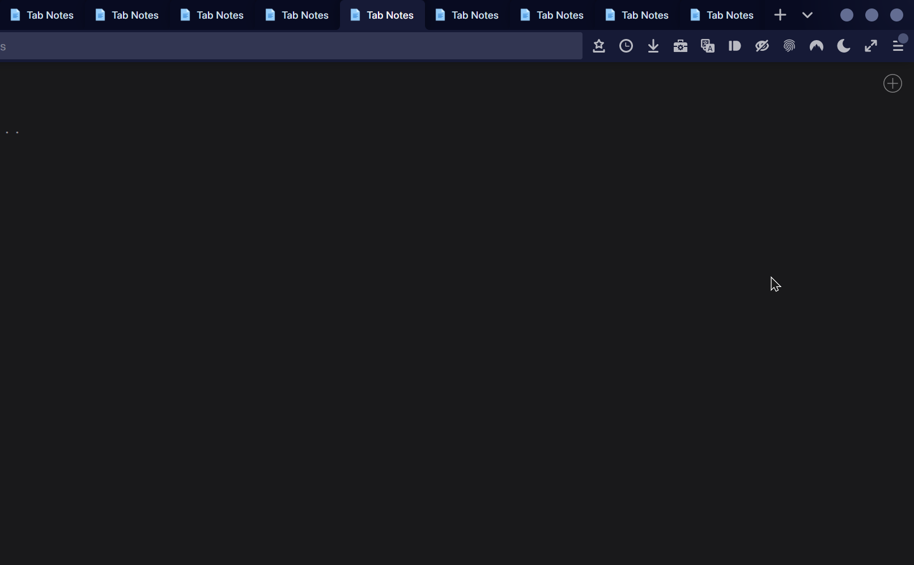

1. Allows you to drag and drop tabs in the all tabs menu.
2. Adds an animated close button for every tab in this menu.
3. Allows you to multiselect tabs in the all tabs menu and close an unlimited number of tabs at once without closing/blurring the popup.
4. Significantly improves the mute/unmute button by making it work like the mute button in the tabs bar used to work.
    - If you only have one tab selected, it mutes/unmutes that tab.
    - If you have multiple tabs selected, it mutes/unmutes all of them.
    - This also adds a tooltip to the mute button.
5. By default, Firefox doesn't do anything to differentiate loaded tabs from unloaded tabs. But for the regular tab bar, unloaded tabs gain an attribute `pending="true"` which you can use to dim them. This way you know which tabs are already initialized and which will actually start up when you click them. Pretty useful if you frequently have 100+ tabs like me.
    - This script adds the same functionality to the all tabs menu, but does not add "pending" styling to regular tabs since it's outside the scope of this project. To do it yourself just add a rule like `.tabbrowser-tab .tab-content{opacity:.6;}`
    - If you use [Unread Tab Mods](/JS/unreadTabMods.uc.js), this integrates with it to make unread tabs display with italic text.
6. Adds color stripes to multiselected tabs and container tabs in the "all tabs menu" so you can differentiate them from normal tabs.
7. Includes a preference `userChrome.tabs.all-tabs-menu.reverse-order` that lets you reverse the order of the tabs so that newer tabs are displayed on top rather than on bottom.
8. Modifies the all tabs button's tooltip to display the number of tabs as well as the shortcut to open the all tabs menu, Ctrl+Shift+Tab.
9. Allows the panel to display pinned tabs, and displays a pin icon on them.
10. Makes the sound icon show if the tab has blocked media or media in picture-in-picture, just like regular tabs.
11. Adds an optional preference `userChrome.ctrlTab.skip-show-all-button` that lets you skip past the "List All x Tabs" button when hitting Ctrl+Tab.
12. And a few other subtle improvements.

All the relevant CSS for this script is already included in and loaded by the script. It's designed to look consistent with my theme as well as with the latest vanilla (Proton) Firefox. If you need to change anything, see the "const css" line in here, or the end of uc-tabs-bar.css on my repo.

</details>

#### [Vertical Tabs Pane](/JS/verticalTabsPane.uc.js):

This script create a vertical pane across from the sidebar that functions like the vertical tabs pane in Microsoft Edge.<details><summary>💬 <i><b>More details...</b></i></summary>


It doesn't hide the tab bar since people have different preferences on how to do that, but it sets an attribute on the root element that you can use to hide the regular tab bar while the vertical pane is open, for example `:root[vertical-tabs] #TabsToolbar...`

By default, the pane is resizable just like the sidebar is. And like the pane in Edge, you can press a button to collapse it, and it will hide the tab labels and become a thin strip that just shows the tabs' favicons. Hovering the collapsed pane will expand it without moving the browser content. As with the `[vertical-tabs]` attribute, this "unpinned" state is reflected on the root element, so you can select it like `:root[vertical-tabs-unpinned]...`

Like the sidebar, the state of the pane is stored between windows and recorded in preferences. There's no need to edit these preferences directly. There are a few other preferences that can be edited in about:config, but they can all be changed on the fly by opening the context menu within the pane. The new tab button and the individual tabs each have their own context menus, but right-clicking anything else will open the pane's context menu, which has options for changing these preferences.

- `Move Pane to Right/Left` will change which side the pane (and by extension, the sidebar) is displayed on, relative to the browser content. Since the pane always mirrors the position of the sidebar, moving the pane to the right will move the sidebar to the left, and vice versa.
- `Reverse Tab Order` changes the direction of the pane so that newer tabs are displayed on top rather than on bottom.
- `Expand Pane on Hover/Focus` causes the pane to expand on hover when it's collapsed. When you collapse the pane with the unpin button, it collapses to a small width and then temporarily expands if you hover it, after a delay of 100ms. Then when your mouse leaves the pane, it collapses again, after a delay of 100ms.
- Both of these delays can be changed with the `Configure Hover Delay` and `Configure Hover Out Delay` options in the context menu, or in about:config.

The pane itself can be turned on or off with a hotkey (Ctrl+Alt+V) or by clicking the toolbar button, which is automatically added to the tab strip and to the top of the pane. As with most toolbar buttons, the toggle button in the navbar can be moved/removed in the "Customize toolbar" menu. The hotkey can be changed by editing the `config` section in the script.

For languages other than English, the labels and tooltips can be modified directly in the `l10n` object inside the script file. All the relevant CSS for this script is already included in and loaded by the script. It's designed to look consistent with my theme as well as with the latest vanilla (Proton) Firefox. If you need to change anything, I recommend doing it in userChrome.css, since any rules you add with `!important` will override this stylesheet's rules. If you don't know where to begin, scroll down to the `let css` line in the script to see the included stylesheet.

The pane's selector is `#vertical-tabs-pane`. While it's open, it will have attribute `[checked]`. While it's unpinned, `[unpinned]` and while expanded, `[expanded]`. While it's on the left, it will have `[positionstart]` just like the built-in sidebar. So you can use those selectors for your own purposes the same way the built-in stylesheet does. Although they're styled a little differently, the individual tab rows are structurally just like the rows in Firefox's built-in all-tabs panel, so if you have custom styling for that panel, you can use it here with minimal changes.

In order to make the scrolling feel just like the built-in tabs bar, I used an `arrowscrollbox` element as the container. It has generally smooth scrolling irrespective of the pointing device, which is a nice feature for an element you expect to scroll frequently. But this means there isn't a visible scrollbar. I could make a config option in the script that switches from `arrowscrollbox` to a regular `vbox` element, which does show its scrollbar. But it would need to be tested extensively just like I did with the arrowscrollbox, so if anyone really wants this, let me know and I'll take it into consideration.

</details>

#### [Toolbox Button](/JS/atoolboxButton.uc.js):

Adds a new toolbar button for devtools features. Probably the single most valuable file on this repo, in my opinion. 1) opens the content toolbox on left click; 2) opens the browser toolbox on right click; 3) toggles "Popup Auto-Hide" on middle click. Mouse buttons can be configured by preference. On macOS, Ctrl+left click is equivalent to right click. By default, it also disables popup auto-hide when you open a toolbox window, and re-enables it when you close the toolbox. (there's a pref to disable this feature)

The icon changes to show whether popup auto-hide is enabled or disabled, and a badge on the button shows whether any toolbox windows are open. Middle-clicking to toggle popup auto-hide also shows a brief confirmation hint, to make it easier to keep track of the state of the preference. See the description at the top of the file for details about usage, configuration, and localization.<details><summary>📽 <i><b>Click here for a preview of the toolbox button's middle click function...</b></i></summary>

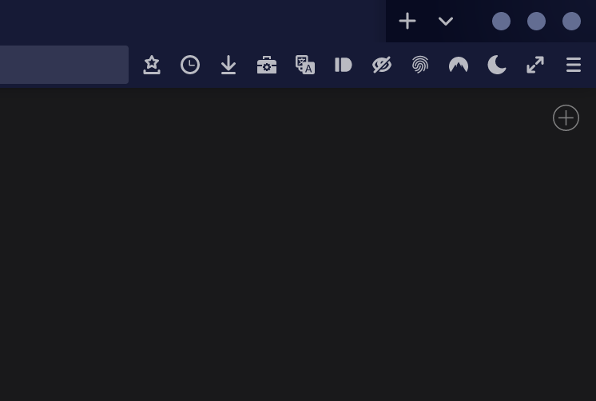

</details>

#### [Bookmarks Popup Mods](/JS/bookmarksPopupShadowRoot.uc.js):

Implement smooth scrolling for all bookmarks popups that are tall enough to scroll. Add unique classes to their shadow parts so they can be styled selectively in CSS. Add special click functions to their scroll buttons — hovering a scroll button will scroll at a constant rate, as normal. (though faster than vanilla) But clicking a scroll button will immediately jump to the top/bottom of the list. Combined with [uc-bookmarks.css](/uc-bookmarks.css), overhauls the appearance of the scroll buttons.

#### [Bookmarks Menu & Button Shortcuts](/JS/bookmarksMenuAndButtonShortcuts.uc.js):

Adds some shortcuts for bookmarking pages. First, middle-clicking the bookmarks or library toolbar button will bookmark the current tab, or un-bookmark it if it's already bookmarked. Second, a menu item is added to the bookmarks toolbar button's popup, which bookmarks the current tab, or, if the page is already bookmarked, opens the bookmark editor popup. These are added primarily so that bookmarks can be added or removed with a single click, and can still be quickly added even if the bookmark page action is hidden for whatever reason. Third, another menu item is added to replicate the "Search bookmarks" button in the app menu's bookmarks panel. Clicking it will open the urlbar in bookmarks search mode.

#### [Clear Downloads Panel Button](/JS/clearDownloadsButton.uc.js):

Place a "Clear Downloads" button in the downloads panel, right next to the "Show all downloads" button.

#### [Copy Current URL Hotkey](/JS/copyCurrentUrlHotkey.uc.js):

Adds a new hotkey (Ctrl+Alt+C by default) that copies whatever is in the urlbar, even when it's not in focus. Key and modifiers are configurable in the script file.

#### [Debug Extension in Toolbar Context Menu](/JS/debugExtensionInToolbarContextMenu.uc.js):
Adds a new context menu for debugging, modding, or styling Firefox extensions. Very handy for Firefox CSS themers and extension designers.<details><summary>💬 <i><b>More details...</b></i></summary>

The menu appears any time the "Manage Extension" and "Remove Extension" items are available. The new "Debug Extension" menu contains several items: _"Extension Manifest"_ opens the extension's manifest directly in a new tab. Aside from reading the manifest, from there you can also view the whole contents of the extension within Firefox by removing "/manifest.json" from the URL.

In the _"View Documents"_ submenu there are 4 options for viewing, debugging and modding an addon's main HTML contents. _"Browser Action"_ opens the extension's toolbar button popup URL (if it has one) in a regular browser window. The popup URL is whatever document it displays in its panel view, the popup that opens when you click the addon's toolbar button. This is the one you're most likely to want to modify with CSS.

_"Page Action"_ opens the extension's page action popup URL in the same manner. A page action is an icon on the right side of the urlbar whose behavior is specific to the page in the active tab. _"Sidebar Action"_ opens the extension's sidebar document, so this would let you debug Tree Style Tab for example. _"Extension Options"_ opens the document that the extension uses for configuration, also in a regular browser window. This could be the page that displays in its submenu on about:addons, or a separate page.

_"Inspect Extension"_ opens a devtools tab targeting the extension background. This is the same page you'd get if you opened about:debugging and clicked the "Inspect" button next to an extension. _"View Source"_ opens the addon's .xpi archive. And, as you'd expect, _"Copy ID"_ copies the extension's ID to your clipboard, while _"Copy URL"_ copies the extension's base URL, so it can be used in CSS rules like `@-moz-document`

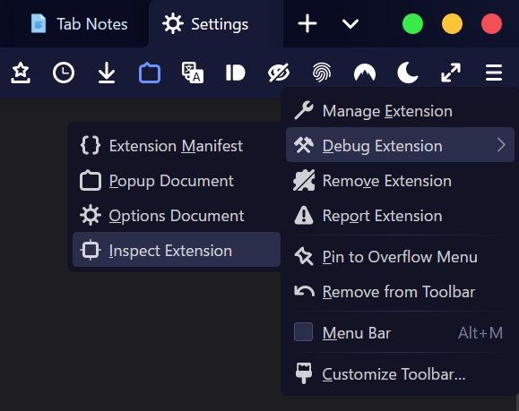

</details>

#### [Extension Options Panel](/JS/extensionOptionsPanel.uc.js):

This script creates a toolbar button that opens a popup panel where extensions can be configured, disabled, uninstalled, etc.<details><summary>💬 <i><b>More details...</b></i></summary>

Each extension gets its own button in the panel. Clicking an extension's button leads to a subview where you can jump to the extension's options, disable or enable the extension, uninstall it, configure automatic updates, disable/enable it in private browsing, view its source code in whatever program is associated with .xpi files, open the extension's homepage, or copy the extension's ID. The panel can also be opened from the App Menu, since the built-in "Add-ons and themes" button is (optionally) replaced with an "Extensions" button that opens the panel, which in turn has an equivalent button inside it. Based on a [similar script](https://github.com/xiaoxiaoflood/firefox-scripts/blob/master/chrome/extensionOptionsMenu.uc.js) by xiaoxiaoflood, but will not be compatible with xiaoxiaoflood's loader. This one requires fx-autoconfig or Alice0775's loader. It opens a panel instead of a menupopup, for more consistency with other toolbar widgets. The script can be extensively configured by editing the values in `static config` on line 11.<details><summary>📽 <i><b>Click here for a preview...</b></i></summary>


</details>

</details>

#### [Eyedropper Button](/JS/eyedropperButton.uc.js):

Adds a toolbar button that implements the color picker without launching the devtools or opening any popups. That is, you can click the button and then immediately click anywhere inside the content window to copy the color of that pixel to your clipboard. Similar to the menu item in the "More Tools" and "Tools > Browser Tools" menus, only this one can be placed directly on your toolbar. The script also adds a customizable hotkey that does the same thing — by default, it's Ctrl+Shift+Y. (or Cmd+Shift+Y on macOS) The color format is determined by `devtools.defaultColorUnit`. For example, changing this preference to "hsl" will give you results like `hsl(25, 75%, 50%)`.

#### [Findbar Mods](/JS/findbarMods.uc.js):

✨ This script adds several improvements and modifications for the findbar, and (optionally) makes it much more horizontally compact and concise by removing wasted space and unnecessary words.
<details><summary>💬 <i><b>More details...</b></i></summary>

1. Make a custom context menu for the findbar that lets you permanently configure findbar-related settings. You can set `Highlight All` and `Whole Words` just like you can with the built-in checkboxes, but this context menu also lets you choose _any_ setting for the `Match Case` and `Match Diacritics` options.

   The built-in checkboxes for these settings only let you choose between states 1 and 0, true and false. There's actually a third state that enables a more useful and intuitive mode. Read the notes in the `l10n` section inside the script for more info on how this setting works.

   Additionally, most of Firefox's built-in findbar checkboxes are only temporary. They only apply to the current browser/tab. This can be useful, but since a context menu requires more intention to reach, its actions should be more permanent. Instead of just setting the browser state, the context menu sets the user preferences just like you could in `about:config`.
2. Set up a hotkey system that allows you to close the findbar by pressing Escape or Ctrl+F while the findbar is focused. Normally, Ctrl+F only opens the findbar. With this script, Ctrl+F acts more like a toggle.

   As normal, when the findbar is closed, Ctrl+F will open it. When the findbar is open but not focused, Ctrl+F will focus it and select all text in the input box. From there, pressing Ctrl+F once more will close it. If you're in 'find as you type' mode, Ctrl+F switches to regular find mode.
3. _(Optional)_ Miniaturize the findbar matches label and the `Match Case` and `Whole Words` buttons. Instead of "1 of 500 matches" this one says "1/500" and floats inside the input box. Remove the checkbox labels and replace the checkboxes with recognizable icons. Together this makes the findbar drastically more compact.

   This feature is enabled by default by the `usingDuskfox` setting in the script. It's mainly intended for people who use CSS themes that make the findbar much more compact, like my theme [duskFox](#theme-css).  If you don't use one of these themes already, you can grab the relevant code from [uc-findbar.css](/uc-findbar.css) on my repo, or if you like having a big findbar, you can just set `usingDuskfox` to false in the script.

   For those interested in customizing this with CSS, the mini matches indicator can be styled with the selector `.matches-indicator`. It's the next sibling of the findbar input box. See [uc-findbar.css](/uc-findbar.css) in this repo for how I styled it. Specific methods used are documented in more detail in the script's code comments.

</details>

#### [Fix Titlebar Button Tooltips](/JS/fixTitlebarTooltips.uc.js):

✨ This script is important if you use my theme or if you customize Firefox's tooltips on your own. Without it, the titlebar buttons' tooltips can't be styled.<details><summary>💬 <i><b>More details...</b></i></summary>

Since [bug 1718629](https://bugzilla.mozilla.org/show_bug.cgi?id=1718629), Firefox has tried to make the titlebar buttons (window controls) function more like native controls. In doing so, it allows the OS to draw tooltips for these buttons. So it prevents itself from showing redundant tooltips. That means we can't style the titlebar buttons' tooltips, they don't obey preferences, they disappear after 5 seconds on Windows, and they don't appear at all in fullscreen mode. Personally I would not be a fan of this change even if I didn't heavily customize Firefox's tooltips, because no matter what, OS tooltips are not going to be consistent with Firefox's tooltips, for reasons I mentioned. But in any case, we can fix this issue with JavaScript. If you were curious, it's caused by the [_titlebar-btn_](https://searchfox.org/mozilla-central/source/browser/base/content/titlebar-items.inc.xhtml#8) attribute.

</details>

#### [Floating Sidebar Resizer](/JS/floatingSidebarResizer.uc.js):

✨ [uc-sidebar.css](/uc-sidebar.css) makes the sidebar float over the content without flexing it, but that changes the way sidebar resizing works. This script is required to make the floating sidebar resizable.<details><summary>💬 <i><b>More details...</b></i></summary>

It also optionally improves the hotkeys a little bit so that Ctrl+B (or Cmd+B) toggles the sidebar on/off instead of exclusively opening the bookmarks sidebar. Instead the hotkey to jump to the bookmarks sidebar has been remapped to Ctrl+Shift+B. This key combination normally toggles the bookmarks toolbar on and off, but I figured it was worth replacing, since you probably either never use the bookmarks toolbar, or keep it open it all the time. Whereas the sidebar is something you're going to want to turn off when you're done using it, since it takes up a lot of space.

</details>

#### [Fluent Reveal Tabs](/JS/fluentRevealTabs.uc.js):

Adds a pretty visual effect to tabs similar to the spotlight gradient effect on Windows 10's start menu tiles. When hovering a tab, a subtle radial gradient is applied under the mouse. Also applies to tabs in the "All tabs menu," and is fully compatible with my All Tabs Menu Expansion Pack. User configuration is towards the top of the script. Inspired by this [proof of concept](https://www.reddit.com/r/FirefoxCSS/comments/ng5lnt/proof_of_concept_legacy_edge_like_interaction), and built on a modified version of [this library](https://github.com/d2phap/fluent-reveal-effect).

#### [Fluent Reveal Navbar Buttons](/JS/fluentRevealNavbar.uc.js):

Adds the same Windows 10-style effect to navbar buttons. When hovering over or near a button, a subtle radial gradient is applied to every button in the vicinity the mouse. This is compatible with [Fluent Reveal Tabs](#fluent-reveal-tabs) so you can use both if you want. The navbar button version has more of a performance hit. I wouldn't recommend using it on weaker hardware if your setup is already pretty heavy with scripts, CSS animations/transitions, or other stateful modifications. </p><details><summary>📽 <i><b>Click here for a preview...</b></i></summary>

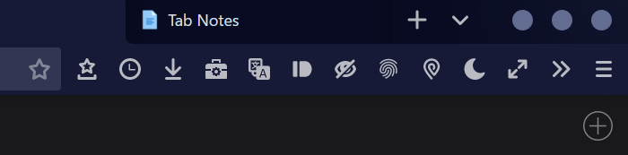

</details>

#### [Fullscreen Hotkey](/JS/fullscreenHotkey.uc.js):

All this does is remap the fullscreen shortcut key from F11 to Ctrl+E, since I use F11 for other purposes.

#### [Auto-hide Navbar Support](/JS/autoHideNavbarSupport.uc.js):

✨ Hides the navbar in fullscreen with a smooth animation, and reveals it when the navbar is hovered or focused _or_ when context menus, panels, etc. are opened from the navbar.<details><summary>💬 <i><b>More details...</b></i></summary>

In Firefox, the navbar hides automatically in fullscreen. But it doesn't have a very smooth animation, and it doesn't handle all possible cases where you'd want the navbar to stay open. This script sets up its own logic to allow CSS transitions to cover the animation. You can use this for any toolbar, whether in fullscreen or not. duskFox just uses it for the navbar while in fullscreen, but your CSS can use it under any circumstances with `popup-status="true"`. That is, you can use this to hide an element and reveal it when menus or panels are opened from the navbar. The CSS transitions are in [uc-fullscreen.css](/uc-fullscreen.css) but you can also do your own thing with this script by using selectors like `box[popup-status="true"] > #navigator-toolbox > whatever`

Without this script, there isn't any good way to pass information to findbars or sidebars about whether the navbar is hovered/focused or popups are open. For the floating findbar and sidebar to work seamlessly, they need to be aware of information like that so they can move up and down in fullscreen when the navbar is hidden/shown. But they're not in the same ancestral chain as the navbar or the popups' anchors, so that information needs to be added to some high-level element with a script, like `#navigator-toolbox-background`. By doing that, we can style almost anything in the chrome document according to `[popup-status]` and `[urlbar-status]`.

</details>

#### [Hide Tracking Protection Icon on Custom New Tab Page](/JS/hideTrackingProtectionIconOnCustomNewTabPage.uc.js):

✨ Hide the url bar's tracking protection icon on the new tab page, even if they are custom pages added by extensions. This is strongly recommended if you use my CSS theme. <details><summary>💬 **_More details..._**</summary>

By default, Firefox hides the tracking protection while 1) the current tab is open to the default new tab page; or 2) the user is typing into the url bar. Hiding the icon while the user is typing is unnecessary, since although `pageproxystate` has changed, the content principal is still the same and clicking the tracking protection icon to open the popup still works. Opening the popup while `pageproxystate` is invalid still loads the tracking details and options for the current content URI. But hiding the icon on the new tab page is necessary, because the tracking protection icon is hidden on `about:blank`.

If you use an extension to set a custom new tab page, you will see the tracking protection icon briefly disappear when opening a new tab, before reappearing as the custom new tab page loads. That is because `about:blank` loads before the custom new tab page loads. So the icon is hidden and unhidden in the span of a hundred milliseconds or so. This looks very ugly, so my stylesheet has always prevented the tracking protection icon from being hidden on any page, including `about:blank`. That way at least it doesn't disappear. But this isn't a great solution, because there are a number of pages for which the tracking protection icon does nothing. The protection handler can't handle internal pages, for example.

Previously I just disabled pointer events on the icon when it was supposed to be hidden. But I think this script is a better solution. If this script is not installed, my theme will default to those older methods I just mentioned. But if the script is installed, it will restore the built-in behavior of hiding the tracking protection icon on internal pages, only it will also hide the icon on the user's custom new tab page. The icon will still be visible if you're on a valid webpage, (web or extension content, not local or system content) even if you begin typing in the urlbar.

</details>

#### [Let Ctrl+W Close Pinned Tabs](/JS/letCtrlWClosePinnedTabs.uc.js):

The name should say it all — this just removes the "feature" that prevents you from closing pinned tabs with the Ctrl+W/Cmd+W shortcut.<details><summary>💬 <i><b>More details...</b></i></summary>

I can't think of any good reason for this, it's not like your hand is likely to slip and hit Ctrl+W by accident. And freeing up the key combination isn't helpful, since every web and extension developer knows the key combination is already taken by every major browser. Blocking the hotkey on pinned tabs just wastes a prime key combination, as well as the user's time.

</details>

#### [Navbar Toolbar Button Slider](/JS/navbarToolbarButtonSlider.uc.js):

✨ My masterpiece, wrap all toolbar buttons after `#urlbar-container` in a scrollable div. It can scroll horizontally through the buttons by scrolling up/down with a mousewheel, like the tab bar. This is meant to replace the widget overflow button that appears to the right of your other toolbar buttons when you have too many to display all at once. Instead of clicking to open a dropdown that has the rest of your toolbar buttons, you can just place all of them in a little horizontal scrollbox. Better yet, you can scroll through them with mousewheel up/down, just like the tab bar. This and the toolbox button have been the most valuable for me personally.<details><summary>⚙ <i><b>For user configuration...</b></i></summary>

This script has several options which can be modified in about:config. By default, it wraps all toolbar buttons that come _after_ the urlbar. (to the right of the urlbar, normally) You can edit `userChrome.toolbarSlider.wrapButtonsRelativeToUrlbar` in about:config to change this: the default value is `after`; a value of `before` will wrap all buttons to the left of the urlbar; and a value of `all` will wrap all buttons.

You can change `userChrome.toolbarSlider.width` to make the container wider or smaller. If you choose `12`, it'll be 12 buttons long. When the window gets _really_ small, the slider disappears and the toolbar buttons are placed into the normal widget overflow panel.

You can disable the overflow panel entirely by setting `userChrome.toolbarSlider.collapseSliderOnOverflow` to `false`.

You can specify more buttons to exclude from the slider by adding their IDs (in quotes, separated by commas) to `userChrome.toolbarSlider.excludeButtons` in about:config. For example you might type `["bookmarks-menu-button", "downloads-button"]` if you want those to stay outside of the slider.

You can also decide whether to exclude flexible space springs from the slider by toggling `userChrome.toolbarSlider.excludeFlexibleSpace` in about:config. By default, springs are excluded.

There is no visible scrollbar in the slider, since it would look pretty awkward with default scrollbar styles. Like the tab strip, you can scroll it with a mousewheel or trackpad.

</details>

#### [One-click One-off Search Buttons](/JS/oneClickOneOffSearchButtons.uc.js):

✨ Restore old behavior for one-off search engine buttons. It used to be that, if you entered a search term in the url bar, clicking a search engine button would immediately execute a search with that engine. This was changed in an update so that clicking the buttons only changes the "active" engine — you still have to press enter to actually execute the search. You also used to be able to advance through your one-off search engine buttons by pressing left/right arrow keys. Until 2021 these functions could be overridden with a preference in about:config, but those settings were removed. This script restores the old functionality.<details><summary>💬 **_More details..._**</summary>

If you want to restore the one-click functionality but don't want the horizontal key navigation, go to about:config and toggle this custom setting to false: `userChrome.urlbar.oneOffs.keyNavigation`. The script also hides the one-off search settings button, but this can be turned off in about:config with `userChrome.urlbar.oneOffs.hideSettingsButton`.

This script also has some conditional functions to work together with [Scrolling Search One-offs](#scrolling-search-one-offs). They don't require each other at all, but they heavily improve each other both functionally and visually. Changing search engines with the arrow keys will scroll the one-offs container to keep the selected one-off button in view. And exiting the query in any way will automatically scroll back to the beginning of the one-offs container, so that it's reset for the next time you use it. The integration between the two is in the form of several subtle little quality-of-life features like that, so it's easier to just test them out together than to explain it all in words.

</details>

#### [Open Bookmarks, History, etc. in New Tabs](/JS/openBookmarksHistoryEtcInNewTabs.uc.js):

In vanilla Firefox, `browser.tabs.loadBookmarksInTabs` only affects bookmark items. When you enable this pref and left-click a bookmark (e.g., in the bookmarks toolbar or menu) it opens in a new tab instead of in the current tab. But if you left-click a history entry or a synced tab, it will still open in the current tab. So you'd have to middle click or ctrl+click to avoid losing your current tab's navigation state. This script just makes that preference apply to history and synced tabs too. It works in every place in the UI (that I'm aware of) from which bookmarks, history or synced tabs can be opened. If you find something this doesn't apply to, please post an [issue](/../../issues/). This script only changes the behavior of `browser.tabs.loadBookmarksInTabs` — you still need to set this pref to true if you want to see any effect.

#### [Open Bookmark in Container Tab (context menu)](/JS/openBookmarkInContainerTab.uc.js):

Adds a new menu to context menus prompted by right-clicking bookmarks, history entries, etc. that allows you to open them in a container tab.<details><summary>💬 <i><b>More details...</b></i></summary>

This does basically the same thing as the [similarly-named addon](https://addons.mozilla.org/firefox/addon/open-bookmark-in-container-tab) by Rob Wu, except it also supports history entries and synced tabs, and of course the method is very different. By doing this with an autoconfig script instead of an addon, we can make the menu appear in a logical order, towards the top of the context menu where all the other "open in x" menu items are, rather than at the very bottom where context menu items from addons always go.

The menu will be present in _all_ context menus where you'd be able to open a bookmark, history entry, or synced tab, including menus, popups, panels, and even the Library/Bookmarks Manager window. However, for synced tabs, it will only be present in the sidebar, not in the profile panel, because the profile panel lacks a context menu in the first place. Right-clicking a synced tab in the profile panel simply opens the synced tab rather than opening a context menu.

Update: The developers of Firefox Multi-Account Containers have implemented an optional setting that creates a similar menu when right-clicking bookmarks. However, this has all the same problems as the addon previously mentioned. It doesn't work on history entries or synced tabs, it puts the menu item at the bottom of the context menu instead of with the other "open x in tab" menu items, and it doesn't apply the correct colors to the container icons.

That is, the "Personal" container is set to blue by default. It shows up as blue in all the native interfaces and in the extension pages & popups. But because extensions can't control context menu CSS, it isn't blue in the extension's optional bookmark context menu. All the icons in the extension menu are just black.

So for several reasons, this script is still the best solution. If you use this script, turn off the redundant extension menus in `about:addons` > Firefox Multi-Account Containers > Options > "Enable Bookmark Menus"

</details>

#### [Open Link in Unloaded Tab (context menu item)](/JS/openLinkInUnloadedTab.uc.js):

Add a new context menu item that can open links in tabs without loading them.<details><summary>💬 <i><b>More details...</b></i></summary>

The item will appear in all context menus that are prompted by right-clicking on links or other link-like affordances. The menu item will open the link in a new background tab, which will start unloaded or "discarded." Specifically, the context menu entry appears in the content area context menu when right-clicking a link; and in every context menu where bookmarks, history, or synced tabs can be interacted with — sidebar, menubar, toolbar, toolbar button popup, and library window.

This has one user configuration preference: `userChrome.openLinkInUnloadedTab.use_link_text_as_tab_title_when_unknown`. This determines what the tab's title will be when you open an unloaded tab from a link that you've never visited before. Without loading the page, Firefox has no idea what to call the tab. The script will try to find a title from your bookmarks and history, but if it's not present in either, it will simply use the URL for the title. But if this preference is set to `true`, instead of using the link URL for the title, it will use the link _text_.

</details>

#### [Private Tabs](/JS/privateTabs.uc.js):

Adds buttons and menu items allowing you to open a "private tab" in nearly any circumstance in which you'd be able to open a normal tab. Instead of opening a link in a private window, you can open it in a private _tab_.<details><summary>💬 <i><b>More details...</b></i></summary>

This started as an fx-autoconfig port of [Private Tab](https://github.com/xiaoxiaoflood/firefox-scripts/blob/master/chrome/privateTab.uc.js) by xiaoxiaoflood. This will use a special container and prevent history storage, depending on user configuration. You can also toggle tabs back and forth between private and normal mode. This script adds two hotkeys: Ctrl+Alt+P to open a new private tab, and Ctrl+Alt+T to toggle private mode for the active tab. These hotkeys can be configured along with several other options at the top of the script file.

</details>

#### [Private Window Homepage](/JS/privateWindowHomepage.uc.js):

By default, private windows are opened to about:privatebrowsing, regardless of your homepage or new tab page preferences. This script simply removes part of a built-in function that manually sets the URL to about:privatebrowsing. So with this script installed, private windows will behave like ordinary windows in this (and only this) respect. They will still be private windows in every other way, they just won't open to a separate home page.

#### [Remove Search Engine Alias Formatting](/JS/removeSearchEngineAliasFormatting.uc.js):

✨ Depending on your settings you might have noticed that typing a search engine alias (e.g. "goo" for Google) causes some special formatting to be applied to the text you input in the url bar. This is a trainwreck because the formatting is applied using the selection controller, not via CSS, meaning you can't change it in your stylesheets. It's blue by default, and certainly doesn't match duskFox very well. This script just prevents the formatting from ever happening at all.

#### [Restore pre-Proton Tab Sound Button](/JS/restoreTabSoundButton.uc.js):

✨ Proton removes the tab sound button and (imo) makes the tab sound tooltip look silly. This restores both, but requires some extra steps and CSS.<details><summary>💬 <i><b>More details...</b></i></summary>

If you want to use my sound icon styles, see [uc-tabs.css](/uc-tabs.css#L503). This script _requires_ that you either:

1. use my theme, complete with [chrome.manifest](/utils/chrome.manifest) and the [resources](/resources) folder, (in which case you'll already have all of the following files and CSS, and only need to download [restoreTabSoundButton.uc.js](/JS/restoreTabSoundButton.uc.js); or...
2. download [tabMods.uc.js](/resources/script-override/tabMods.uc.js) and put it in `<your profile>/chrome/resources/script-override/` and edit the [utils/chrome.manifest](/utils/chrome.manifest) file that comes with fx-autoconfig to add the following line (at the bottom):

```override chrome://browser/content/tabbrowser-tab.js ../resources/tabMods.uc.js```

For those who are curious, this will override the tab markup template and some methods relevant to the sound & overlay icons. We can't use a normal script to do this because, by the time a script can change anything, browser.xhtml has already loaded tabbrowser-tab.js, the tab custom element has already been defined, and tabs have already been created with the wrong markup. This wasn't required in the past because `.tab-icon-sound` wasn't fully removed, just hidden. But as of June 06, 2021, the sound button is entirely gone in vanilla Firefox 91. So [tabMods.uc.js](/resources/script-override/tabMods.uc.js) restores the markup and class methods; [restoreTabSoundButton.uc.js](/JS/restoreTabSoundButton.uc.js) restores and improves the tooltip; and [uc-tabs.css](/uc-tabs.css#L503) rebuilds the visual appearance.<details><summary>If you don't use my theme, restoring the sound button will also require some CSS.<br/>📋 <i><b>Click to expand...</b></i></summary>

```
.tab-icon-sound {
    margin-inline-start: -16px;
    width: 16px;
    height: 16px;
    padding: 0;
    -moz-context-properties: fill;
    fill: currentColor;
    border-radius: var(--tab-button-border-radius, 2px);
    list-style-image: none;
    background-repeat: no-repeat;
}
.tab-icon-sound[soundplaying],
.tab-icon-sound[pictureinpicture][soundplaying]:hover {
    background-image: url('data:image/svg+xml;utf8,<svg xmlns="http://www.w3.org/2000/svg" width="18px" height="18px" viewBox="0 0 18 18"><path fill="context-fill" d="M3.52,5.367c-1.332,0-2.422,1.09-2.422,2.422v2.422c0,1.332,1.09,2.422,2.422,2.422h1.516l4.102,3.633 V1.735L5.035,5.367H3.52z M12.059,9c0-0.727-0.484-1.211-1.211-1.211v2.422C11.574,10.211,12.059,9.727,12.059,9z M14.48,9 c0-1.695-1.211-3.148-2.785-3.512l-0.363,1.09C12.422,6.82,13.27,7.789,13.27,9c0,1.211-0.848,2.18-1.938,2.422l0.484,1.09 C13.27,12.148,14.48,10.695,14.48,9z M12.543,3.188l-0.484,1.09C14.238,4.883,15.691,6.82,15.691,9c0,2.18-1.453,4.117-3.512,4.601 l0.484,1.09c2.422-0.605,4.238-2.906,4.238-5.691C16.902,6.215,15.086,3.914,12.543,3.188z"/></svg>');
    background-size: 12px;
    background-position: center;
    margin-inline-start: 1px;
}
.tab-icon-sound[muted],
.tab-icon-sound[pictureinpicture][muted]:hover {
    background-image: url('data:image/svg+xml;utf8,<svg xmlns="http://www.w3.org/2000/svg" width="18px" height="18px" viewBox="0 0 18 18"><path fill="context-fill" d="M3.52,5.367c-1.332,0-2.422,1.09-2.422,2.422v2.422c0,1.332,1.09,2.422,2.422,2.422h1.516l4.102,3.633V1.735L5.035,5.367H3.52z"/><path fill="context-fill" fill-rule="evenodd" d="M12.155,12.066l-1.138-1.138l4.872-4.872l1.138,1.138 L12.155,12.066z"/><path fill="context-fill" fill-rule="evenodd" d="M10.998,7.204l1.138-1.138l4.872,4.872l-1.138,1.138L10.998,7.204z"/></svg>');
    background-size: 12px;
    background-position: center;
    margin-inline-start: 1px;
}
.tab-icon-sound[activemedia-blocked] {
    background-image: url('data:image/svg+xml;utf8,<svg xmlns="http://www.w3.org/2000/svg" viewBox="0 0 12 12"><path fill="context-fill" d="M2.128.13A.968.968 0 00.676.964v10.068a.968.968 0 001.452.838l8.712-5.034a.968.968 0 000-1.676L2.128.13z"/></svg>');
    background-size: 8px;
    background-position: 4.5px center;
    margin-inline-start: 1px;
}
.tab-icon-sound[pictureinpicture] {
    background-image: url('data:image/svg+xml;utf8,<svg xmlns="http://www.w3.org/2000/svg" viewBox="0 0 625.8 512"><path fill="context-fill" fill-opacity="context-fill-opacity" d="M568.9 0h-512C25.6 0 0 25 0 56.3v398.8C0 486.4 25.6 512 56.9 512h512c31.3 0 56.9-25.6 56.9-56.9V56.3C625.8 25 600.2 0 568.9 0zm-512 425.7V86c0-16.5 13.5-30 30-30h452c16.5 0 30 13.5 30 30v339.6c0 16.5-13.5 30-30 30h-452c-16.5.1-30-13.4-30-29.9zM482 227.6H314.4c-16.5 0-30 13.5-30 30v110.7c0 16.5 13.5 30 30 30H482c16.5 0 30-13.5 30-30V257.6c0-16.5-13.5-30-30-30z"/></svg>');
    background-size: 12px;
    background-position: center;
    border-radius: revert;
    margin-inline-start: 1px;
}
.tab-icon-sound[pictureinpicture]:-moz-locale-dir(rtl) {
    transform: scaleX(-1);
}
.tab-icon-sound[soundplaying]:not(:hover),
.tab-icon-sound[muted]:not(:hover),
.tab-icon-sound[activemedia-blocked]:not(:hover) {
    opacity: 0.8;
}
.tab-icon-sound[soundplaying-scheduledremoval]:not([muted], :hover),
.tab-icon-overlay[soundplaying-scheduledremoval]:not([muted], :hover) {
    transition: opacity 0.3s linear var(--soundplaying-removal-delay);
    opacity: 0;
}
.tab-icon-sound-label,
.tab-secondary-label {
    display: none !important;
}
.tab-icon-sound {
    display: -moz-box !important;
}
.tab-icon-sound:not([soundplaying], [muted], [activemedia-blocked], [pictureinpicture]),
.tab-icon-sound[pinned] {
    display: none;
}
.tab-icon-overlay {
    display: none !important;
}
.tab-close-button {
    padding: 2px !important;
    width: 16px !important;
    height: 16px !important;
}
.tabbrowser-tab:hover .tab-icon-stack > :not(.tab-close-button),
.tabbrowser-tab:not(:hover) .tab-close-button {
    visibility: collapse;
}
.tabbrowser-tab {
    --tab-label-mask-size: 2em !important;
}
```

</details>

</details>

#### [Restore pre-Proton Arrowpanels](/JS/restorePreProtonArrowpanels.uc.js):

✨ The mother of all Proton reversals. Bring back the arrows at the top corner of <i>arrow</i>panels (like the app menu or the history button's popup panel).<details><summary>💬 <i><b>More details...</b></i></summary>

Probably my least favorite "feature" of the UI refresh has been the removal of arrows from arrowpanels. I'd call it misguided, except I can't figure out what guided it in the first place. I mean — they're called <i>arrow</i>panels, and that should really say it all. The point of arrows is to point at something. In this case, to point at the node to which the panel is anchored. Some might think it's enough that the popup simply be anchored to the node. That might be true for small elements like tooltips. But panels are big enough that they can be lined up with many nodes, especially when they're opened on a toolbar that's full of other buttons.

It's not like there aren't other ways to see where the panel is anchored, but why give the user less information? Moreover, don't the arrows look good? This change, more than any of the other ones, feels like change for change's sake. Stripping things down merely for the sake of simplifying them. Anyway, this script will basically restore a bunch of stuff that was removed in Nightly 96.0a1 — the CSS, JS, and markup. So in this sense it's a complete package and does not require duskFox, but you will probably want it if you use my theme. Arrowpanels' glory days are not behind them, not if I have anything to say about it...

</details>

#### [Restore pre-Proton Downloads Button](/JS/restorePreProtonDownloadsButton.uc.js):

✨ Restores the pre-Proton downloads button icons and animations.<details><summary>💬 <i><b>More details...</b></i></summary>

I kept the new progress animation, but I made it thicker. If you use my theme or my icons you'll definitely want this for the sake of consistency. If you don't use my theme or icons but you still want the old downloads button back, download the [_standalone_](/JS/restorePreProtonDownloadsButton-standalone.uc.js) version instead. The standalone version has the stylesheet and icons built-in, so doesn't require anything else except a script loader. This version requires [userChrome.au.css](/userChrome.au.css) and the [resources/downloads](/resources/downloads) folder.

</details>

#### [Restore pre-Proton Library Button](/JS/restorePreProtonLibraryButton.uc.js):

✨ The library toolbar button used to have an animation that played when a bookmark was added. It's another casualty of the Proton updates. This script restores the library button animation in its entirety, with one minor improvement.<details><summary>💬 <i><b>More details...</b></i></summary>

The library animation always looked just a tiny bit off for certain window scaling factors — the animation would appear about half a pixel from where the static icon is, causing it to appear to move when the animation finishes. The script can fix this, so see the description at the top of the file for details on enabling the scaling fix. This version of the script requires fx-autoconfig, [userChrome.au.css](/userChrome.au.css) and the [resources/skin](/resources/skin) folder. If you don't want to download those files, grab the [_standalone_](/JS/restorePreProtonLibraryButton-standalone.uc.js) version instead.

</details>

#### [Restore pre-Proton Star Button](/JS/restorePreProtonStarButton.uc.js):

✨ The bookmark page action button used to have a pretty cool starburst animation that played when you added a bookmark. This script restores it.<details><summary>💬 <i><b>More details...</b></i></summary>

The main version of this script requires fx-autoconfig, [userChrome.au.css](/userChrome.au.css), and the [resources](/resources) folder from my repo. If you don't want to use all that stuff, grab the [_standalone_](/JS/restorePreProtonStarButton-standalone.uc.js) version instead. If you use the standalone version, you won't need any additional CSS or icon downloads, and you can use other script loaders instead of fx-autoconfig. FYI not to state the obvious but this script will have no effect if your browser/OS has `prefers-reduced-motion` enabled.

</details>

#### [Screenshot Page Action Button](/JS/screenshotPageActionButton.uc.js):

Creates a screenshot button in the page actions area (the right side of the urlbar) that works just like the screenshot toolbar button. Firefox used to have one built in. I had to write this from scratch so the code is different under the hood, but the end result for the user is functionally identical to the original button that was removed around April 2021.

#### [Scrolling Search One-offs](/JS/scrollingOneOffs.uc.js):

✨ This script allows the search one-offs box to be scrolled with mousewheel up/down OR left/right. This is for use with my theme, which moves the one-off search engine buttons to the right side of the url bar when the user is typing into the url bar. It won't do much without the CSS from [uc-search-one-offs.css](/uc-search-one-offs.css) to set up the layout of the one offs element.

#### [Search Mode Indicator Icons](/JS/searchModeIndicatorIcons.uc.js):

✨ _v1.4+ is strongly recommended for duskFox users._ Automatically replace the urlbar's identity icon with the current search engine's icon. [(📽 Click for a preview)](preview/prev-search.gif) Optionally replace the searchglass icon in regular search mode by dynamically retrieving icons from your [resources/engines](/resources/engines) folder.<details><summary>💬 <i><b>More details...</b></i></summary>

That means on the new tab page or when typing in the urlbar, instead of showing a searchglass icon it will show a Google icon if your default engine is Google; a Bing icon if your default engine is Bing; etc.

If duskFox doesn't have an icon for your search engine, you can add your own icons by downloading them to the engines folder. (Icons must have an SVG, PNG, JPG, or JPEG file extension) If your search engine's name is "Amazon Search" then your icon file should be named `amazonsearch.svg`. The script will automatically locate it and set a global variable to the icon's URL. If you don't use duskFox, you can use that variable yourself by referencing `var(--default-search-identity-icon)`.

Also optionally show _any_ engine name in the urlbar placeholder, even if the engine was installed by an addon. By default, Firefox _only_ shows your default engine's name in the placeholder if the engine was built into Firefox. With this script, the placeholder will include the name of your engine irrespective of its origin. This can be disabled in the script's config section.

The script's main feature (setting the identity icon to match the current engine in one-off search mode) also adds an `[engine]` attribute to the identity icon so you can customize the icons yourself if you don't like a search engine's icon, or want to adjust its dimensions. If you have google set to "goo" and type in goo then hit spacebar, the identity icon will change to a google icon. And it'll also gain an attribute reflecting that, so you can change its icon further with a CSS rule like: `#identity-icon[engine="Tabs"] {color: red}`

This doesn't change anything about the layout so you may want to tweak some things in your stylesheet. For example I have mine set up so the tracking protection icon disappears while the user is typing in the urlbar, and so a little box appears behind the identity icon while in one-off search mode. This way the icon appears to the left of the label, like it does on about:preferences and other UI pages.

Without any additional CSS, the script will use the same icon that shows in the search engine's one-off button in the urlbar results. But as I mentioned before, you can use the `[engine]` attribute to customize it further. I have a bunch of customize search engine icons in [uc-search-mode-icons.css](/uc-search-mode-icons.css), which gets its icon files from the [resources/engines](/resources/engines) folder.

</details>

#### [Search Selection Keyboard Shortcut](/JS/searchSelectionShortcut.uc.js):

Adds a new keyboard shortcut (Ctrl+Shift+F) that searches for whatever text you currently have highlighted. This does basically the same thing as the context menu option "Search {Engine} for {Selection}" except that if you highlight a URL, (meaning text that is likely a URL, even if it's not a clickable hyperlink) instead of searching for the selection it will navigate directly to the URL. Includes preferences for user configuration. <details><summary>💬 **_More details..._**</summary>

Optionally, you can also configure the script to use your other (non-default) search engines as well. The preference `userChrome.searchSelectionShortcut.match-engine-to-current-tab` will add a second hotkey (Ctrl+Alt+F) that will look for an installed engine that matches the current webpage. So if your default search engine is Google but you use the hotkey on Wikipedia, and you have a search engine for Wikipedia installed, it will search Wikipedia for the selected text instead of Google. This preference is disabled by default, since some extensions may use that key combination. You can toggle it in a popup that appears the first time you install the script, or in about:config.

But what if you have a non-default search engine that you want to use for a particular website? Let's say you're on about:config, browsing through preferences. You highlight a pref name and hit the hotkey to search for it and find out what it does. Normally, pressing the second hotkey will launch your default engine, since about:config doesn't correspond to any normal URL. But by setting the pref `userChrome.searchSelectionShortcut.custom-matches`, you can "link" any website to any engine. This pref accepts a JSON formatted object containing zero or more name-value pairs, separated by commas. The object format is `{<site>: <engine>}`

Here's an example: `{"about:config": "Searchfox", "bugzilla.mozilla.org": "searchfox.org", "raw.githubusercontent.com", "https://github.com/search?q=%s"}`

The example above showcases several different accepted formats. `site` represents a website you might visit, and `engine` represents the engine to use when you press the hotkey while on the `site`. So the first one means _use Searchfox when the hotkey is activated on about:config_. This is JSON, so all `site` and `engine` values must be wrapped in quotes and the pairs must be separated by commas, or the pref won't work at all.

A `site` value must be some kind of valid URL. Ideally a host (domain) is best, but it doesn't have to be a host, as some types of URLs lack hosts. If you're unsure what the host is for a website you're trying to link to an engine, open the website in a browser tab, open the content toolbox, and type `location.host`. For pages that lack hosts or have local protocols (like `moz-extension://` URLs) you can specify the page's complete URL, like `moz-extension://blahblah/index.html`

An `engine` value can be either 1) an engine's name — that's the label that appears next to the search engine in the UI, e.g. `Google`; 2) the domain on which the search engine is hosted, e.g. `www.google.com`; or 3) the engine's full search template URL, or something close to it, e.g. `www.google.com/search?q=%s`. Any of these values will work, but using the engine's name is most efficient.

If you already use these hotkeys for something else, e.g., an extension, you can change the hotkey itself (though not the modifiers) by setting `userChrome.searchSelectionShortcut.keycode` to a valid [KeyboardEvent code](https://developer.mozilla.org/docs/Web/API/KeyboardEvent/code). The default value `KeyF` corresponds to the F key. The correct notation is different for numbers and special characters, so visit [keycode.info](https://keycode.info) and press your desired key to find the `event.code` you need to input for the preference. In the future I may add modifier customization support, if users request it.

</details>

#### [Show Selected Sidebar in Switcher Panel](/JS/showSelectedSidebarInSwitcherPanel.uc.js):

✨ For some reason, Proton removes the checkmark shown on the selected sidebar in the sidebar switcher panel. (The one that pops up when you click the button at the top of the sidebar) This script simply restores the previous behavior of adding the [checked] attribute. On its own it won't do anything, since the CSS for adding checkmarks to the menu items has also been removed. You'll need [uc-sidebar.css](/uc-sidebar.css) and the radio icon from the [resources](/resources) folder for the actual styling, or you can just read it starting around [line 120](/uc-sidebar.css#L120) if you want to make your own styles.

#### [Tab Context Menu Navigation](/JS/tabContextMenuNavigation.uc.js):

Add some new menuitems to the tab context menu for navigating tabs back/forward, reloading, or bookmarking them, without needing to open them.<details><summary>💬 <i><b>More details...</b></i></summary>

Includes Back, Forward, Reload, and Bookmark. The new menuitems look just like the navigation group at the top of the content area context menu. So they're oriented horizontally and have icons instead of labels. But functionally, they're a bit different. If you click the "Reload" button, for example, instead of reloading the current tab it will reload the tab you right-clicked to open the context menu. If you had multiple tabs selected and you right-clicked one of them, it will reload all of them. If you click the "Back" button, it will navigate the context tab(s) back by one.

So, this gives you some capabilities not already available in Firefox. In particular, you can navigate back/forward in tabs without opening them, since it operates on the context tab rather than the active tab. You can also navigate back/forward in multiple tabs at once. This script was made by request. It's not recommended on macOS, since the context menu items and functions are significantly different. It should be technically compatible but it might look weird depending on your settings.

</details>

#### [Tab Tooltip Navigation Buttons](/JS/tabTooltipNavButtons.uc.js):

This script turns the tab tooltip into a mini navigation popup with back, forward, and reload buttons. It still shows the tab's title and URL, and also shows its favicon. So it's similar to the vanilla tooltip, except it's interactive.<details><summary>💬 <i><b>More details...</b></i></summary>

When you hover a tab for 500 milliseconds (the actual delay depends on `ui.tooltipDelay` when opening, and `userChrome.tabs.tabTooltipNavButtons.hover-out-delay` when closing, both of which you can set as number prefs in about:config) the navigation popup will open attached to that tab. Clicking the back button will navigate _that tab_ back one step, rather than only navigating the currently active tab. So this means you can navigate background tabs.

The buttons work very much like the back, forward, and reload buttons on your toolbar. So a regular left click will go back or forward or reload, while a middle click or ctrl+click will duplicate the tab while going back or forward or reloading. A shift click will duplicate the tab in a new window instead. Basically all the same features that are present in the built-in toolbar buttons.

The key difference (aside from navigating the hovered tab rather than the active tab) is that the buttons can navigate multiple tabs at once. If you multiselect tabs, e.g., by shift or ctrl+clicking them, and then hover one of the multiselected tabs, all the buttons in the popup will navigate all the multiselected tabs at once. So if you right-click a tab and click "Select all Tabs" in the context menu, then hover a tab and click the reload button in the popup, it will reload every tab you have open. If you have tabs multiselected but you hover one of the non-selected tabs, then the popup will only affect the hovered tab, not the multiselected tabs.

There are some additional configuration options inside the script. You can make the popup dependent on a modifier key being pressed, and continue using the vanilla Firefox tab tooltip when the modifier key is not pressed. You can also change the button tooltips to match your Firefox language pack.</p><details><summary>🖼 <i><b>Click here for a preview...</b></i></summary>


</details>

</details>

#### [Toggle Menubar Hotkey](/JS/toggleMenubarHotkey.uc.js):

Adds a hotkey (Alt+M by default) that toggles the menubar on and off. Unlike just pressing the Alt key, this keeps it open permanently until closed again by the hotkey, toolbar context menu, or customize menu. Requires [**fx-autoconfig**](https://github.com/MrOtherGuy/fx-autoconfig) — other script loaders will not work with this script.

#### [Tooltip Shadow Support](/JS/tooltipShadowSupport.uc.js):

✨ This script makes it easier to add box shadows and borders to tooltips without messing up some specific tooltips. <details><summary>💬 <i><b>More details...</b></i></summary>

Some tooltips have an awkward structure, where multiple descriptions exist within a single container, with `display: -moz-popup`. This means the tooltip is displayed within a restricted popup area with dimensions equal to the container, and overflow completely hidden. Box shadows on the container therefore won't be visible, since they'll fall outside of the popup frame — you'd have to use a window shadow instead, but those can't be styled in a precise way.

In tooltips with only 1 label we can just make the container transparent and put the background and box shadow on the label element. That way there can still be room within the popup frame for the box shadow to be visible. A box shadow with a 5px radius can fit well within a container with ~7px padding. Tooltips with a more elaborate structure with containers within containers, e.g. the tab tooltip, don't have this problem at all. But tooltips like the back and forward buttons' can only be given a shadow if you give each label a background color, and try to position and size them so that they perfectly overlap and create the illusion of being one element.

But if you also want rounded corners and borders, that won't be an option. A good way to fix this is just to put the tooltips inside of another container, so that's what this script does. Because generic tooltips are native-anonymous, they don't inherit variables from the main window. So if you want to customize the theme's tooltips, you have to edit [userChrome.ag.css](/userChrome.ag.css) directly to change some things. If you want to disable the borders, 1) don't use this script, and 2) go to about:config and set `userChrome.css.remove-tooltip-borders` to true.

</details>

#### [Tracking Protection Middle Click Toggle](/JS/trackingProtectionMiddleClickToggle.uc.js):

Middle click the tracking protection icon in the urlbar to enable/disable tracking protection on the active tab. A minor change, but it's faster than left-clicking to open the panel, then clicking the actual toggle switch.

#### [Animate Context Menus](/JS/animateContextMenus.uc.js):

Gives all context menus the same opening animation that panel popups like the app menu have — the menu slides down 70px and fades in opacity at the same time. It's a cool effect that doesn't trigger a reflow since it uses transform, but it does repaint the menu, so I wouldn't recommend using this on weak hardware.

#### [Undo Recently Closed Tabs in Tab Context Menu](/JS/recentlyClosedTabsContextMenu.uc.js):

Adds new menus for restoring recently closed tabs/windows to the tab context menu. Also adds a context menu for right-clicking recently closed tab/window items in the history menu.

<details><summary>💬 <i><b>More details...</b></i></summary>

Adds new menus to the context menu that appears when you right-click a tab (in the tab bar or in the Tree Style Tab sidebar): one lists recently closed tabs so you can restore them, and another lists recently closed windows. These are basically the same functions that exist in the history toolbar button's popup, but I think the tab context menu is a more convenient location for them.

Also optionally adds a context menu to the history panel's subview pages for "Recently closed tabs" and "Recently closed windows" with various functions for interacting with the closed tabs and their session history. You can right-click a closed tab item to open the context menu, then click "Remove from List" to get rid of it. You can click "Remove from History" to not only remove the closed tab item, but also forget all of the tab's history — that is, every page it navigated to. The same can be done with recently closed windows. From this menu you can also restore a tab in a new window or private window, bookmark a closed tab/window, and more.

With another option, the script will add container colors to recently closed tab items. As with container tabs in general, this is meant to work in tandem with [Firefox Multi-Account Containers](https://addons.mozilla.org/firefox/addon/multi-account-containers/?utm_source=github.com/aminomancer/uc.css.js&utm_medium=referral) but does not require the extension, since a slimmer version of it is built into Firefox. If you open a tab with the "Personal" container and then close it and open the recently closed tabs menu, the tab you closed will show up with a little blue stripe on its edge. This feature (and several others) can be configured from within the script file.

</details>

_This script used to be named `undoListInTabContextMenu.uc.js` so make sure you delete that one if you still have it. This version is a huge update._

#### [Unread Tab Mods](/JS/unreadTabMods.uc.js):

Modifies some tab functions so that unread tabs can be styled differently from other tabs, and (optionally) adds new items to the tab context menu so you can manually mark tabs as read or unread.<details><summary>💬 <i><b>More details...</b></i></summary>

When opening a new tab without selecting it, the tab will gain an attribute `notselectedsinceload`. It will lose this attribute when the tab becomes selected or becomes discarded/unloaded. The CSS for styling unread tabs is already included in duskFox. (the CSS theme on this repo) If you don't use my theme, you can style unread tabs yourself with CSS like this:

```
.tabbrowser-tab[notselectedsinceload]:not([pending]),
.tabbrowser-tab[notselectedsinceload][pending][busy] {
    font-style:italic!important;
}
```

</details>

#### [Update Notification Slayer](/JS/updateNotificationSlayer.uc.js):

🌠 Prevent "update available" notification popups; instead just create a badge on the app menu button (like the one that ordinarily appears once you dismiss the notification). This isn't required for the theme, but is very useful if you use the theme with Firefox Nightly, as intended.<details><summary>💬 **_More details..._**</summary>

Everything on this repo is designed to work with [Firefox Nightly](https://www.mozilla.org/firefox/channel/desktop/#nightly), but Nightly receives updates twice per day. By default, that means you'll be prompted to update twice per day, and those update prompts can't be dismissed except by manually clicking the dismiss button. So, if you're someone who's used to Firefox automatically updating itself once every month or two, switching to Nightly can be a nuisance.

Some users try to deal with this by using CSS to hide the update notification box. But that would also hide the notification box that shows when an addon has been updated and is requesting new permissions. Even worse, that doesn't really dismiss the notification, and notifications only create app menu banners and hamburger button badges once the notification popup has been dismissed. So if you used CSS, you'd never even know when an update is available unless you went out of your way to click Help > About Nightly.

A much better way is to use JavaScript to change the way update notifications behave. Firefox already has a system for creating "badge-only" notifications. It just doesn't apply to update notifications. This script simply changes that, turning all update notifications into badge-only notifications. Instead of creating a popup, update notifications will only create app menu banners and badges. So you'll see a little green update icon 🟢 on the app menu button, and when clicking it, there will be a green banner at the top of the app menu.

You can use this with or without auto install (the "Automatically install updates" setting in about:preferences > Nightly Updates). There used to be a bug where you couldn't open the browser toolbox if an update was installed and waiting for you to restart Firefox, but I believe this has been fixed. So feel free to keep auto update enabled.

I still prefer to disable auto install so I can control when I update. With auto install disabled, you'll still automatically receive update alerts in the form of unobtrusive badges/banners, since Firefox always _checks_ for updates, irrespective of user settings. It simply means that instead of prompting you to restart Firefox, the banner will prompt you to _download_ the update, and then 10-15 seconds later, prompt you to restart. To change this setting, you can't use about:config, you must go to about:preferences and click the radio buttons under "Nightly Updates." The background service checkbox doesn't matter, but I would personally recommend enabling it.

</details>

#### [Concise Update Banner Labels](/JS/updateBannerLabels.uc.js):

Simply changes the update banners in the hamburger button app menu to make the strings a bit more concise. Instead of "Update available — download now" it will show "Download Nightly update" (or whatever your version is) for example.

#### [Urlbar can Autofill Full Subdirectories](/JS/urlbarAutofillSubdir.uc.js):

Allows the urlbar to autofill full file paths from history instead of just host names. For example, if you type "red" Firefox will normally just autofill "reddit.com" for the first result. With this script, if you visit reddit.com/r/FirefoxCSS more frequently than reddit.com, it will autofill the full URL to the subreddit, so you can navigate to it with just an Enter keypress. However, if you visit the root directory more often than any individual subdirectory, it will choose the root directory. For example, most people probably visit youtube.com way more often than any particular video page. So it will never suggest youtube.com/watch?v=whatever, since youtube.com will always have a higher visit count.

#### [Urlbar Mods](/JS/urlbarMods.uc.js):

✨ Makes several optional modifications to the urlbar, urlbar results, search engines UI, and other subtle or complicated urlbar-related systems. I'll continue adding more features to this script, so it's worth updating from time to time.

<details><summary>💬 <i><b>More details...</b></i></summary>

1. When you click & drag the identity box in the urlbar, it lets you drag and drop the URL into text fields, the tab bar, desktop, etc. while dragging it shows a little white box with the URL and favicon as the drag image. This script changes the colors of that drag box so they use CSS variables instead, and therefore fit much more consistently with the browser theme, whether light or dark.
2. By default, urlbar results are not sorted consistently between regular mode and search mode. When you use the urlbar normally, the order of urlbar results is determined by a pref: `browser.urlbar.showSearchSuggestionsFirst`

   This pref is true by default, so search suggestions are shown at the top of the list. When you enter "search mode," e.g. by clicking a one-off search engine button in the urlbar results panel, this pref is no longer used. Suggestions are shown at the top of the list no matter what — it's hard-coded into the urlbar muxer's sort function.

   If you don't change the pref this shouldn't matter, since they both show suggestions at the top of the list. But if you set the pref to false, (e.g. if you want top or recent site URLs to appear at the top of the list so you don't have to hit Tab so many times to reach them) you'll get URLs at the top of the list in regular mode, and URLs at the bottom of the list in search mode.

   In my opinion [this is a bug](https://bugzilla.mozilla.org/show_bug.cgi?id=1727904), but as of 09/21 it does not look like Mozilla intends to accept a fix, so I'm putting my fix in this script. This setting changes the way sorting is calculated in search mode. Instead of automatically and invariably showing suggestions first, it will simply respect the `showSearchSuggestionsFirst` preference, just like it does in regular mode.
3. Optionally disable urlbar intervention tips. These are the urlbar results that prompt you to reset your profile or clear your cache when you type something similar. They're intended to make it easier for new users to find these functions, but they take up result slots and selecting them by mistake can have serious repercussions, even including a nearly complete profile wipe. So I disable them entirely.
4. When you have syncing enabled, typing `%` in the urlbar will show tabs that were synced from your other devices. Normally, the only indication that a result is a synced tab is the "action text" that shows the name of the device from which the tab was synced. duskFox (the CSS theme) adds a little type indicator icon to urlbar results like bookmarks, open tabs, pinned results, and synced tabs. duskFox's indicator for synced tabs is normally a little sync icon.

   But with this script, it will show a device icon instead, such as a phone or a laptop, to match the device from which the tab came. So if the tab was synced from an iPhone, you'll see a phone icon next to the row's favicon. If it came from an iPad, you'll see a tablet icon, and so on. This is meant to match how the "send tab to device" buttons look in the app menu.

   It doesn't require duskFox, but duskFox makes urlbar results' type icons look a lot better in my opinion, and it adds type icons for several types of results that don't normally have them.
5. Add missing tooltips to the identity icon on pages where it has no tooltip in vanilla Firefox. When the connection is secure it says "Verified by: Some CA." When the connection is insecure it says "Connection is not secure." It has tooltips for extension pages and pages that were blocked due to certificate errors until the user overrode the block. But for everything else, there is simply no tooltip. It doesn't just revert to a default tooltip, it simply has no tooltip. This seems like a mistake since the other urlbar icons always have a tooltip.

   So this setting adds tooltips for every security state. This includes tooltips like "This is a secure Firefox page" for system pages like `about:preferences`, "This page is stored on your computer" for local files, "Parts of this page are not secure (such as images)" for mixed security pages, "Firefox has blocked parts of this page that are not secure" for pages made secure by blocking content, and so on.

   This way, any time you hover over the identity icon, it will definitely show a tooltip. The tooltip will usually contain the same basic description as the identity popup. But the identity popup can only be opened with a click, so a tooltip is often preferred, at least in cases like this where the information can always easily fit into a small tooltip.
6. Give the identity icon unique classes and therefore icons on `about:neterror` and `about:blocked` pages. It already has unique classes for `about:certerror` and `about:httpsonlyerror`, which are used in vanilla Firefox to give them different icons. One gets the insecure lock icon, the other gets the mixed security lock icon. duskFox instead gives all the error pages a unique error icon so they can be distinguished from ordinary insecure/mixed pages.

   To style _all_ of the error pages is _only_ possible with this script, since in vanilla Firefox `about:neterror` and `about:blocked` are only marked as `.unknownIdentity` which is the default class. So the script gives them special classes, `.aboutNetErrorPage` and `.aboutBlockedPage` which can be selected in CSS.
7. Optionally restore the context menu that used to appear when right-clicking a search engine one-off button in the urlbar results panel. This feature is disabled by default, since the context menu has very few options in it. But as with the other script features, you can enable it by toggling a config value at the top of the script.
8. When you type nothing but Space or Tab characters in the urlbar, the first result will have an empty title. It will just say "Search with Google" or something like that, with no indication that any search terms exist at all. Consecutive whitespace characters don't add to the displayed node width, so it ends up looking basically empty. We can change this by setting it to use non-breaking spaces instead of regular space characters, and adding an attribute "all-whitespace" to the title element. Then we can underline it with CSS. This is already done in [uc-urlbar-results.css](uc-urlbar-results.css) but if you wanna do it yourself: `.urlbarView-title[all-whitespace] {text-decoration: underline}`

</details>

#### [Add [open] Status to Urlbar Notification Icons](/JS/urlbarNotificationIconsOpenStatus.uc.js):

✨ All this does is set an attribute on the buttons in `#notification-popup-box` based on whether their popups are open or closed. That way we can set their fill-opacity to 1 when they're open, like we do already with the other icons in `#identity-box`. There aren't any ways to do this with pure CSS as far as I can tell, so it's necessary to make our own event listeners. (or we could override the class methods in PopupNotifications.jsm, but that would require more frequent updates) Very minor improvement, but also very cheap and easy, so I figured might as well make the icon opacity consistent. _Doesn't have any visual effect without [uc-urlbar.css](uc-urlbar.css)_ or your own styles like `#notification-popup-box>[open="true"]{fill-opacity:1;}`

#### [Urlbar Container Color Indicator](/JS/urlbarContainerColor.uc.js):

A lightweight aesthetic script that changes the background color of the urlbar to match the active tab's contextual identity (aka multi-account container).<details><summary>💬 <i><b>More details...</b></i></summary>

Made by request. Will conflict with any custom themes/stylesheets that set the background color of `#urlbar-input-container` with `!important` rules, so be sure to check your stylesheet if it's not working. You can add the following code to the bottom of your custom stylesheet to make sure the color rules win out:
```
#urlbar-input-container[contextid] {
    background-color: color-mix(in srgb, transparent 75%, var(--identity-tab-color)) !important;
}

#urlbar[open] #urlbar-input-container[contextid] {
    border-bottom-left-radius: 0 !important;
    border-bottom-right-radius: 0 !important;
}

#urlbar[open]
    > #urlbar-input-container[contextid]
    ~ .urlbarView
    > .urlbarView-body-outer
    > .urlbarView-body-inner {
    border-color: transparent !important;
}
```

</details>

#### [Scroll Urlbar with Mousewheel](/JS/urlbarMouseWheelScroll.uc.js):

Implements vertical scrolling and smooth scrolling inside the urlbar's input field.<details><summary>💬 <i><b>More details...</b></i></summary>

That might sound weird, but the urlbar doesn't naturally have any special scrolling logic, so when it's overflowing due to a long URL, scrolling it with a mouse wheel can be a real bitch, and scrolling it horizontally with a trackpad would feel really janky. This makes all scrolling in the urlbar smooth, and lets you scroll it horizontally with mousewheel up/down, since it can't be scrolled vertically anyway.

</details>

#### [Scroll Urlbar Results with Mousewheel](/JS/urlbarViewScrollSelect.uc.js):

This script lets you cycle through urlbar results with mousewheel up/down, and invoke the current selected result by right-clicking anywhere in the urlbar results area. Nothing too special, just makes one-handed operation with a trackpad a little easier. Scroll events are rate-throttled proportionally to their magnitude, so it should be comfortable to scroll with any kind of input device, even including a trackpad or ball.

#### [Backspace Panel Navigation](/JS/backspacePanelNav.uc.js):

Press backspace to navigate back/forward in popup panels. (e.g. the main hamburger menu, the history toolbar button popup, the "all tabs" menu, etc.) If a subview is open, backspace will go back to the previous view. If the mainview is open, pressing backspace will close the popup the same way pressing escape would.

#### [Autocomplete Popup Styler](/JS/autocompletePopupStyler.uc.js):

✨ Gives autocomplete popups a different background color when they're opened on elements with a background color that would otherwise blend in with the autocomplete popup.<details><summary>💬 <i><b>More details...</b></i></summary>

This mini-script adds an attribute to `#PopupAutoComplete` when it's opened on a panel in the chrome UI, rather than opened on an input field in the content area: `[anchored-on-panel="true"]`. The reason for this is that the duskFox stylesheets give panels and menupopups the same background color, as is typical, but remove the borders.

So without this, if the autocomplete popup opened on a panel, (for example the notification popup you get when Firefox asks to save a password) it would end up blending in with the panel, which doesn't look great. When it opens inside the content area, we want it to keep its normal background color, `var(--arrowpanel-background)`. But when it opens in a panel, we want to give it a brighter background color, `var(--autocomplete-background)`. This is implemented in [userChrome.au.css](/userChrome.au.css) by this rule:
```
panel[type="autocomplete-richlistbox"][anchored-on-panel] {
    --panel-background: var(--autocomplete-background);
}
```

</details>

#### [Window Drag Hotkey](/JS/windowDragHotkey.uc.js):

Hold down the Alt and Shift keys and click & drag any part of a toolbar to drag the entire window. Normally you can only drag the window in empty spaces. Clicking and dragging a button, a tab, an input field, etc. will not drag the window. With this script, while you hold down the Alt and Shift keys, ANY element in a toolbar basically becomes a drag space. Alt and Shift were chosen because there aren't any Alt+Shift+Click functions, as far as I know. Upon releasing the keys, everything will go back to normal.

#### [OS Detector](/JS/osDetector.uc.js):

✨ Strongly recommended if you want to use duskFox on macOS or Linux. Might also be useful to other people developing CSS themes for Firefox, since it lets you select for operating systems with 100% accuracy.<details><summary>💬 <i><b>More details...</b></i></summary>

This tiny setup script adds an attribute on the document element representing the operating system, so we can select it with CSS. For example `:root[operatingsystem="macosx"]` would select the root element only on macOS. There are already ways to select different windows versions and a less reliable way to target linux, but the existing CSS options for selecting macOS are very sloppy. This is because Firefox differentiates between operating systems during the build and install processes. A given end user's `browser.css` will contain different rules depending on their operating system, obviating the need for a convenient media query but neglecting the customization angle.

Since media queries aren't available, and I don't want to create and manage 3+ different versions of this theme, the stylesheets can only distinguish between operating systems when this script is running. Since I develop this on Windows 10, the theme expects Windows 10 by default. If you use Windows 10, you don't need this script, since all the default rules will be targeted for your OS. If you use the theme on macOS or linux, however, you will definitely want to download this, as it will enable the special OS-specific rules targeting your OS.

</details>

#### [Custom Hint Provider](/JS/customHintProvider.uc.js):

A confirmation hint library that works and looks just like the confirmation hint built into Firefox, but allows custom messages to be sent.<details><summary>💬 <i><b>More details...</b></i></summary>

This is a utility script for other scripts to take advantage of. It sets up a global object (on the chrome window) for showing confirmation hints with custom messages. The built-in confirmation hint component can only show a few messages built into the browser's localization system. This script works just like the built-in confirmation hint, and uses the built-in confirmation hint element, but it accepts any arbitrary string as a parameter. So you can open a confirmation hint with _any_ message, e.g.
```
CustomHint.show(anchorNode, "This is my custom message", {
    hideArrow: true,
    hideCheck: true,
    description: "Awesome.",
    duration: 3000
});
```
This script is entirely optional — some of my scripts take advantage of it, if it's present, but will not break if it's not present. My scripts that _require_ it come with their own independent version of it built-in. It doesn't do anything on its own, it's sort of a micro-library. You may as well download it if you use any of my scripts, since it can't hurt anything and will provide useful feedback for some of my scripts. I'm uploading it as a separate component so other developers can use it, and to avoid adding too much redundant code in my other scripts.

</details>

#### [Agent/Author Sheet Loader](/JS/userChromeAgentAuthorSheetLoader.uc.js):

✨ Required for loading [userChrome.ag.css](/userChrome.ag.css) and [userChrome.au.css](/userChrome.au.css), and therefore pretty much a non-negotiable requirement for duskFox. This script will actually load any file in the `chrome` folder that ends in `ag.css`, `au.css`, or `us.css`. Files ending in `au.css` will be loaded as author sheets, `ag.css` as agent sheets, and `us.css` as user sheets. User sheets are roughly equivalent to userChrome.css, so probably aren't necessary for anything, but the functionality is there in the unlikely event you ever need it. So you may add your own stylesheets simply by putting them in the `chrome` folder — no need to `@import` them. Stylesheets should be loaded in alphabetical order. Make sure you remove the files that come with fx-autoconfig in the `JS` folder, or you'll end up loading redundant stylesheets.

#### [Browser Toolbox Stylesheet Loader](/JS/userChromeDevtoolsSheetLoader.uc.js):

✨ Required for loading stylesheets into browser toolbox windows. If you want context menus in the devtools to look consistent with context menus elsewhere, grab this script. [See here](#styling-browser-toolbox-windows) for more info.

#### [Misc. Mods](/JS/miscMods.uc.js):

Various tiny mods not worth making separate scripts for. Read the comments [inside the script](/JS/miscMods.uc.js) for details.

## **Thanks to my sponsors for [supporting](https://github.com/sponsors/aminomancer) this project:**
<ul>
    <li><a href="https://github.com/KleinByte"> Jordyn Kleinheksel (KleinByte)</a></li>
    <li><a href="https://github.com/henryxrl"> Henry Xu (henryxrl)</a></li>
</ul>

## **Other useful links:**

<details><summary>🔗 <b><i>Click to expand...</i></b></summary>

[Searchfox](https://searchfox.org): A search engine for Firefox's source code. This is what I use to write most of my scripts. For example, if you wanted to make a button that adds a bookmark, you could find something in the UI that already does that, copy its ID, and search for it on Searchfox. From there you could track down its callback function, copy something from that and search for it, and ultimately find what you need. It indexes several repositories, including multiple versions of Firefox. You can permanently add this search engine to Firefox with [this extension](https://addons.mozilla.org/firefox/addon/add-custom-search-engine), which makes writing code for Firefox immensely faster.

[FirefoxCSS Subreddit](https://www.reddit.com/r/FirefoxCSS): Where to bring questions about modding Firefox.

[FirefoxCSS Store](https://firefoxcss-store.github.io): A collection of Firefox CSS themes. If my theme is too complicated or labor-intensive for you, there are some really nice themes there that don't require autoconfig.

[userChrome.org](https://www.userchrome.org): A site hosted by Jefferson Scher with a lot of [information](https://www.userchrome.org/what-is-userchrome-css.html), [guides](https://www.userchrome.org/how-create-userchrome-css.html), [tools](https://www.userchrome.org/firefox-89-styling-proton-ui.html), and other [resources](https://www.userchrome.org/help-with-userchrome-css.html) for modding Firefox, [setting up autoconfig](https://www.userchrome.org/what-is-userchrome-js.html), etc.

[firefox-csshacks](https://github.com/MrOtherGuy/firefox-csshacks): A huge collection of CSS snippets (big and small) and information about CSS theming, by the author of fx-autoconfig. If there's something you're trying but struggling to do with CSS, this is a good place to start.

[Alice0775 scripts](https://github.com/alice0775/userChrome.js): Another repo full of Firefox scripts. Most of these should be compatible with fx-autoconfig. There's another autoconfig loader on this repo, but some of my scripts require fx-autoconfig specifically.

[xiaoxiaoflood scripts](https://github.com/xiaoxiaoflood/firefox-scripts): Another repo full of up-to-date Firefox scripts and addons. These won't be compatible with fx-autoconfig but there's another loader on this repo.

[Add custom search engines](https://addons.mozilla.org/firefox/addon/add-custom-search-engine): An extremely useful addon that can generate search engines for Firefox. That is, if a website you use has an internal search engine that uses URL queries or x-suggestions, e.g. `https://wikipedia.org/wiki/Special:Search?search=%s`, you can use this addon to turn it into a one-off search engine, and thereby search wikipedia from your urlbar, and even get search suggestions from wikipedia in your urlbar results.

[mozlz4-edit](https://addons.mozilla.org/firefox/addon/mozlz4-edit): An addon that can read, edit, and save .lz4/.mozlz4 files. Mozilla uses the LZ4 algorithm to compress all sorts of things from caches to databases, but in particular your one-off search engines. The addon above should be sufficient for most people, but if you need to make changes to a search engine you already created and don't want to redo it (or forgot how) this will let you. Just open the search.json.mozlz4 file in your profile folder.

[Violentmonkey](https://addons.mozilla.org/firefox/addon/violentmonkey): An addon for running JavaScript in browser tabs. If you need to modify a particular website, this is the best way. This is overall the best GreaseMonkey-like addon for Firefox, in my opinion.

[SVG Gobbler](https://www.svggobbler.com): A new browser extension that can locate and retrieve all the SVG images/icons on a webpage. Very useful for CSS ricing, especially if you use a dark theme since you'll often need to turn dark icons into light icons. You don't strictly need this but it'll speed up the process.

[Sidebar Always Loaded](https://github.com/thepante/SAL-Firefox): A very cool script that makes the sidebar more permanent and less intrusive. It's similar to my Floating Sidebar script but 100% standalone, 50% more elegant, and has ~25% more features. Compatible with [fx-autoconfig](https://github.com/MrOtherGuy/fx-autoconfig) or [Alice0775's loader](https://github.com/alice0775/userChrome.js/tree/master/72).

[NsCDE](https://github.com/NsCDE/NsCDE): A really cool Unix desktop environment package that integrates with Firefox and many other applications to produce remarkably consistent user interfaces.

[Lepton](https://github.com/black7375/Firefox-UI-Fix): A Firefox theme that respects the vanilla Firefox UI "flavor" while fixing many of the biggest problems with Proton.

[Adapting Firefox to Windows 10 accent colors](https://www.reddit.com/r/FirefoxCSS/comments/ocjsmr/my_almost_comprehensive_css_for_making_firefox): A really handy guide and template on how to make Firefox's Proton UI consistent with your personalized Windows 10 color scheme.

[MDN — Browser Toolbox](https://developer.mozilla.org/docs/Tools/Browser_Toolbox): The first tutorial to read if you're trying to get into modding Firefox, whether CSS or JavaScript.

[MDN — CSS Cascade](https://developer.mozilla.org/docs/Web/CSS/Cascade): If your CSS background is limited to reading posts on r/FirefoxCSS and experimenting in the browser toolbox, learning some of the quirks of CSS may be very helpful. You can save a lot of trial & error time by knowing beforehand that something won't work.

[JavaScript — Understanding the weird parts](https://www.udemy.com/course/understand-javascript): A really good course if you're trying to learn JavaScript from scratch. It doesn't concern the many internal APIs/components that you'd use in Firefox scripts, like XPCOM, but you definitely want to know most of this stuff beforehand to avoid wasting a lot of time.

</details>
